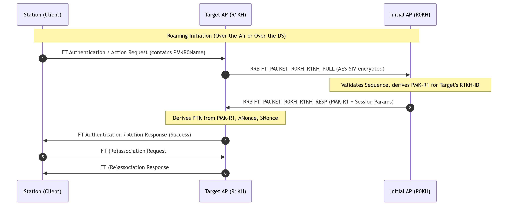

### Overview

<div style="text-align: justify; text-indent: 2em;">
On a WLAN, when a STA moves between different APs, the service continuity and data transmission stability must be ensured. In traditional roaming technologies, when a STA roams from one AP to another, the STA needs to re-perform identity authentication and key negotiation. As a result, services are interrupted for a long time during roaming, degrading user experience. To solve this problem, the 802.11r standard is introduced. 802.11r, or Fast Basic Service Set Transition (FT), allows a STA to complete authentication and key negotiation with the target AP in advance. This process skips 802.1X authentication and key negotiation during roaming, reducing the number of information exchanges and achieving low latency and service data flow continuity during roaming.
</div>


--- 

### 802.1x Implementation


--- 

### Fast BSS Transition


1. Each STA-AP combination needs a 4-Way-Handshake generate the PTK from the PMK.
2. Each STA-AP combination needs a PMK.


#### Key Hierarchy

<div style="text-align: center;">


</div>

<div style="text-align: center;">


</div>

<div style="text-align: center;">


</div>

1. The R0KH interacts with the IEEE 802.1X Authenticator to receive the MSK resulting from an EAP authentication.
2. The R1KH interacts with the IEEE 802.1X Authenticator to open the Controlled Port.

#### Is Fast BSS Transition available?

1. mobility domain: A set of basic service sets (BSSs), within the
same extended service set (ESS), that support fast BSS transitions
between themselves and that are identi ed by the set’s mobility
domain identi er (MDID).
2. mobility domain identi er (MDID): An identi er that names
a mobility domain.

<div style="text-align: center;">


</div>

---

### Over-the-Air

<div style="text-align: center;">


</div>


### Over-the-DS

<div style="text-align: center;">


</div>


---

### FT Protocols

1. FT protocol
2. FT resource request protocol

This protocol is executed when an FTO requires a resource request prior to its transition.

<div style="text-align: center;">


</div>


<div style="text-align: center;">


</div>

---

### Frame by Frame


#### MSK -> PMK-R0


#### PMK-R0 -> PMK-R1


The computation of PMK-R0 and PMK-R1, and all of the intermediate
results in the computations, shall be restricted to the R0KH.


#### PMK-R1 -> PTK


The computation of PTK, and all intermediate results
in its computation, shall be restricted to the R1KH.


<div style="text-align: justify; text-indent: 2em;">
The R0KH and the R1KH are assumed to have a secure channel between them that can be used to
exchange cryptographic keys without exposure to any intermediate parties. The cryptographic strength
of the secure channel between the R0KH and R1KH is assumed to be greater than or equal to the
cryptographic strength of the channels for which the keys are used.
</div>


---

### Relationship between state and services between a given pair of nonmesh STAs


---

### 802.11r in Hostapd

#### Overview and Purpose

In IEEE 802.11r (Fast BSS Transition / FT), roaming between Access Points (APs) within a Mobility Domain (MD) is designed to occur with minimal latency (< 50 ms) to support real-time applications such as Voice over IP (VoIP) and video streaming without requiring full 802.1X/EAP re-authentication against a RADIUS server.

The RRB (Remote Request Broker) mechanism is the inter-AP backbone protocol that enables APs to communicate over the Distribution System (DS / wired backbone LAN) to:
1. Relay FT Action frames between the Current AP and Target AP during FT-over-the-DS roaming.
2. Distribute security keys (`PMK-R1`) securely between Key Holders (R0KH $\leftrightarrow$ R1KH) across the network backbone using cryptographic protection.

#### 802.11r Key Hierarchy and Architectural Roles

To understand RRB, it is essential to understand the 802.11r key hierarchy:

```
                  [ Master Session Key (MSK) / PMK ]
                    (from 802.1X/EAP or FT-PSK)
                                |
                                v
                   [ First-Tier Key: PMK-R0 ]
                      Held by R0KH (R0 Key Holder)
                                |
             +------------------+------------------+
             |                                     |
             v                                     v
   [ Second-Tier: PMK-R1 ]               [ Second-Tier: PMK-R1 ]
   Held by AP1 (R1KH-1)                  Held by AP2 (R1KH-2)
             |                                     |
             v                                     v
    [ Pairwise Transient Key ]            [ Pairwise Transient Key ]
            (PTK)                                 (PTK)
```

#### Key Entities:

* R0KH (R0 Key Holder): The initial AP or central controller that holds the first-tier key `PMK-R0` derived after the initial mobility domain association.
* R1KH (R1 Key Holder): The AP serving a specific BSSID that holds `PMK-R1` (derived from `PMK-R0` specific to the Target AP's identifier/BSSID) and derives the final encryption key (`PTK`) with the station.
* S1KH (Supplicant 1 Key Holder): The roaming Station (STA / Client).
* Current AP vs. Target AP: The AP to which the STA is currently connected vs. the AP to which the STA intends to roam.

#### The Two Primary Functions of RRB

##### Function A: FT-over-the-DS Frame Encapsulation (Standard IEEE 802.11r)

IEEE 802.11r defines two modes for roaming:
1. **FT-over-the-Air:** The client switches channels and sends standard 802.11 Authentication frames directly to the Target AP.
2. **FT-over-the-DS:** The client stays on its current channel and sends 802.11 FT Action frames to the Current AP, which encapsulates them in RRB frames and forwards them across the Ethernet backbone to the Target AP.

##### Over-the-DS Flow:

```
       [ Client (STA) ]
          |          ^
(1) FT Action      (4) FT Action
    Request            Response
          v          |
     [ Current AP ]  ====== (2) RRB Request (EtherType 0x890D) =====>  [ Target AP ]
                     <===== (3) RRB Response (EtherType 0x890D) =====
```

* **EtherType:** `0x890D` (`ETH_P_RRB`).
* **Frame Header (`struct ft_rrb_frame`):**
  * `frame_type`: `RSN_REMOTE_FRAME_TYPE_FT_RRB` (`0x01`).
  * `packet_type`: `FT_PACKET_REQUEST` (`0`) or `FT_PACKET_RESPONSE` (`1`).
  * `action_length`: 16-bit length of the enclosed FT Action frame.
  * `ap_address`: 6-byte MAC address of the transmitting AP.
  * `payload`: 802.11 Action frame body (Category `WLAN_ACTION_FT`, Action code, Station MAC, Target AP MAC, status code, and IEs like MDIE, FTIE, RSNIE).

##### Function B: R0KH $\leftrightarrow$ R1KH Key Management Protocol

When a station roams to a Target AP (operating as an R1KH), that Target AP needs the corresponding `PMK-R1` to derive the `PTK`. The RRB mechanism provides a secure protocol for inter-AP key retrieval.



###### Key Distribution Packet Types:
| Subtype Code | Packet Subtype Constant | Description |
| :--- | :--- | :--- |
| `0x01` | `FT_PACKET_R0KH_R1KH_PULL` | Sent by Target AP ($R1KH$) to $R0KH$ requesting `PMK-R1` for a roaming STA. |
| `0x02` | `FT_PACKET_R0KH_R1KH_RESP` | Sent by $R0KH$ back to $R1KH$ containing the derived `PMK-R1` and session parameters. |
| `0x03` | `FT_PACKET_R0KH_R1KH_PUSH` | Proactive distribution: $R0KH$ derives and sends `PMK-R1` to all configured neighbor $R1KH$ APs immediately upon initial STA association. |
| `0x04` | `FT_PACKET_R0KH_R1KH_SEQ_REQ` | Sequence request used to synchronize anti-replay sequence state. |
| `0x05` | `FT_PACKET_R0KH_R1KH_SEQ_RESP` | Response containing sequence parameters for anti-replay verification. |

####  RRB Packet Format and Cryptographic Protection

RRB key distribution frames are encapsulated in IEEE 802 Extended OUI EtherType frames and secured using **AES-SIV (Synthetic Initialization Vector, RFC 5297)** for Authenticated Encryption with Associated Data (AEAD).

```
+-------------------------------------------------------------------------+
| IEEE 802 Extended OUI EtherType Frame Header                            |
+-------------------------------------------------------------------------+
| Auth Length (16-bit little endian)                                      |
+-------------------------------------------------------------------------+
| Authenticated TLVs (Plaintext, protected by AES-SIV AAD):               |
|   - FT_RRB_SEQ (Domain ID, Sequence Number, Timestamp)                  |
|   - FT_RRB_NONCE (16-byte random challenge nonce)                       |
|   - FT_RRB_R0KH_ID (NAS Identifier / FQDN of R0KH)                      |
|   - FT_RRB_R1KH_ID (6-byte BSSID / Identifier of R1KH)                  |
+-------------------------------------------------------------------------+
| Encrypted TLVs (AES-SIV Ciphertext + SIV tag):                          |
|   - FT_RRB_S1KH_ID (Client STA MAC address)                             |
|   - FT_RRB_PMK_R0_NAME (16-byte PMK-R0 Name)                            |
|   - FT_RRB_PMK_R1 (256/384-bit PMK-R1 Key)                              |
|   - FT_RRB_PAIRWISE (Pairwise Cipher Suite)                             |
|   - FT_RRB_EXPIRES_IN (Key lifetime in seconds)                         |
|   - FT_RRB_VLAN_UNTAGGED / FT_RRB_VLAN_TAGGED (VLAN Configuration)     |
|   - FT_RRB_IDENTITY (User identity from 802.1X)                         |
|   - FT_RRB_RADIUS_CUI (Chargeable-User-Identity)                        |
|   - FT_RRB_SESSION_TIMEOUT (Session timeout)                            |
+-------------------------------------------------------------------------+
```

#### Security Details

* **AES-SIV AEAD:** Associated Authenticated Data (AAD) binds the Source MAC address, authenticated TLVs, and message subtype to prevent tampering, injection, and address spoofing.
* **Anti-Replay Mechanism:** Each AP pair tracks monotonically increasing sequence numbers (`ft_rrb_seq`) and timestamps to prevent replay attacks.
* **Pairwise Inter-AP Secret Keys:** APs share 256-bit symmetric encryption keys configured in their respective R0KH/R1KH lists.

#### Hostapd Configuration Example

Below is a typical configuration in `hostapd.conf` configuring RRB and FT:

```ini
##### 802.11r Fast BSS Transition Configuration #####
wpa=2
wpa_key_mgmt=FT-PSK FT-EAP
wpa_pairwise=CCMP

# 2-octet Mobility Domain Identifier (must match across all APs in domain)
mobility_domain=a1b2

# NAS Identifier for this AP (R0KH-ID)
r0_key_holder=r0kh-ap1.network.local

# 6-octet R1KH-ID (defaults to BSSID)
r1_key_holder=02:01:02:03:04:05

# Dedicated interface for RRB distribution (e.g., wired bridge)
ft_iface=br-lan

# Enable FT-over-the-DS action frame forwarding (1 = enabled, 0 = disabled)
ft_over_ds=1

# Push PMK-R1 proactively to all neighbor APs upon client association (1 = enabled)
pmk_r1_push=1

# List of R0KHs in the mobility domain:
# Format: <MAC address> <NAS Identifier> <256-bit Hex Key>
r0kh=02:01:02:03:04:05 r0kh-ap1.network.local 000102030405060708090a0b0c0d0e0f000102030405060708090a0b0c0d0e0f
r0kh=02:01:02:03:04:06 r0kh-ap2.network.local 00112233445566778899aabbccddeeff00112233445566778899aabbccddeeff

# List of R1KHs in the mobility domain:
# Format: <MAC address> <R1KH-ID> <256-bit Hex Key>
r1kh=02:01:02:03:04:05 02:01:02:03:04:05 000102030405060708090a0b0c0d0e0f000102030405060708090a0b0c0d0e0f
r1kh=02:01:02:03:04:06 02:01:02:03:04:06 00112233445566778899aabbccddeeff00112233445566778899aabbccddeeff

# Timeouts & Retries
rkh_pull_timeout=1000
rkh_pull_retries=4
```

#### Key Benefits of the RRB Mechanism

1. **Sub-50ms Seamless Handoff:** Enables real-time communications without dropouts by eliminating round-trips to the central RADIUS authentication server.
2. **Channel Optimization:** Over-the-DS roaming allows the station to negotiate its handover via the wired backbone without having to switch radio channels prematurely.
3. **Session Continuity & Policy Preservation:** Transports VLAN assignments, session timeouts, and RADIUS accounting attributes across APs seamlessly.
4. **Strong Backbone Security:** Protects key material using AES-SIV authenticated encryption with anti-replay guarantees.

---

### Source 

[1] www.thewlpc.com/presentations/analysis-of-a-fast-roam-prg-25