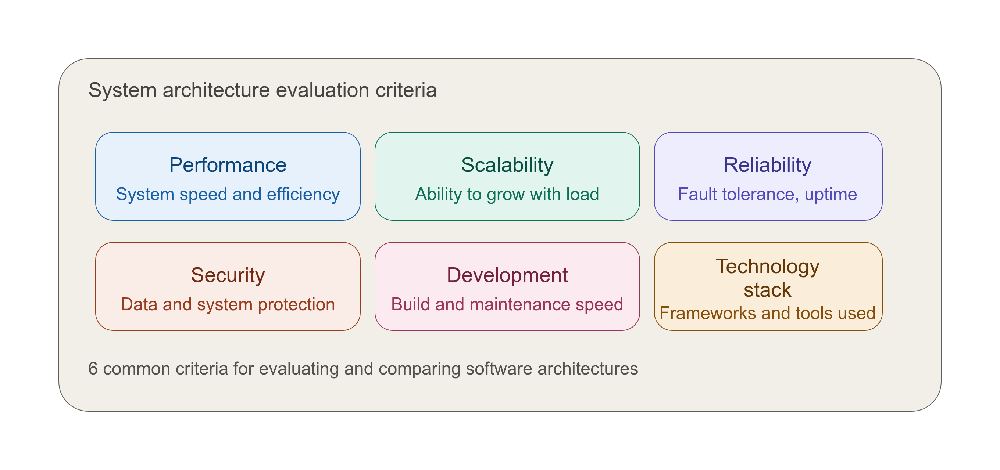
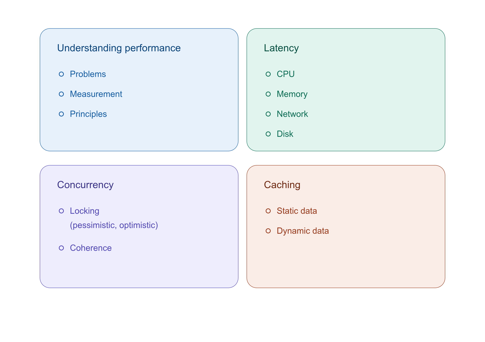

## Developer To Architect

## Performance

#### Measure of how fast or responsive a system is under
- A given workload: Backend data, Request volume
- A given hardware: Kind, Capacity

#### How to spot a performance problem?
Every performance problem is the result of some queue building somewhere. 
- Network socket queue, DB IO queue, OS run queue etc
- Reasons for queue build-up: Inefficient slow processing, Serial resource access, Limited resource capacity

#### Performance Principles
- Efficiency: Efficient Resource Utilization: IO (Memory, Network, Disk), CPU
- Efficient Logic: Algorithm, DB Queries
- Efficient Data Storage: Data Structures, DB Schema
- Caching
- Concurrency: Hardware, Software (Queuing, Coherence)
- Capacity
