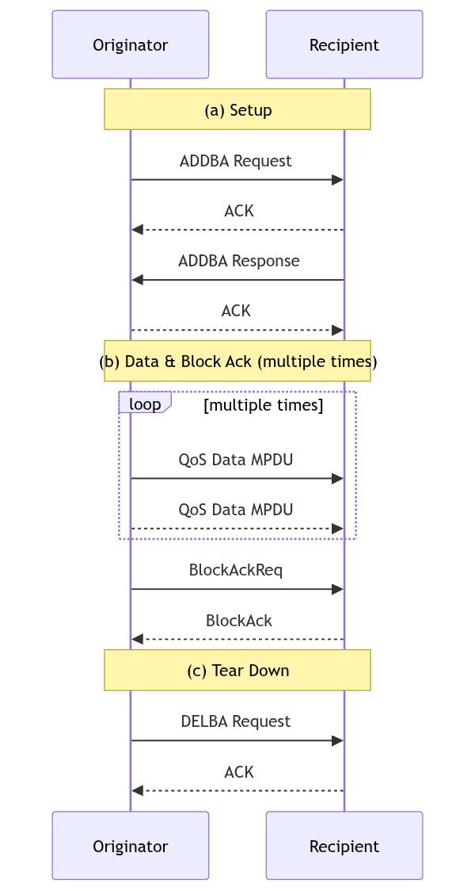
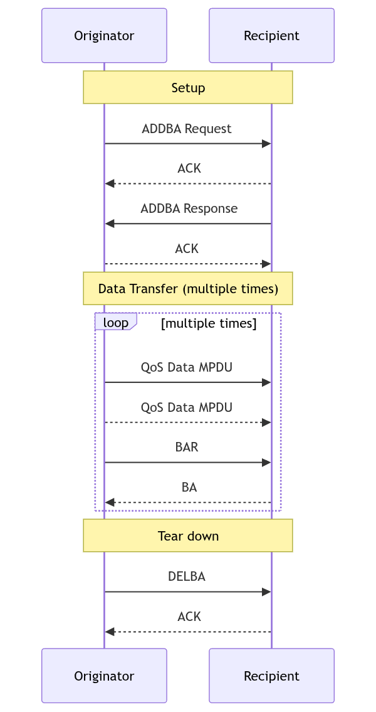
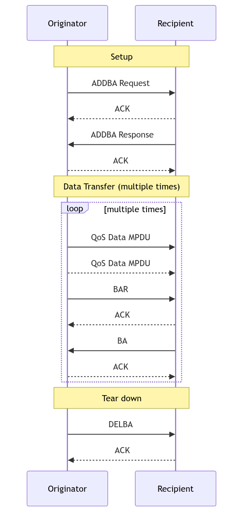

### Message Flow

The Block Ack mechanism improves channel efficiency by aggregating several acknowledgments into one frame. There are two types of Block Ack mechanisms, immediate and delayed. Immediate Block Ack is suitable for high-bandwidth, low-latency traffic while the delayed Block Ack is suitable for applications that tolerate moderate latency.
The Block Ack mechanism is initialized by an exchange of ADDBA Request/Response frames. After initialization, blocks of QoS data frames may be transmitted from the originator to the recipient. A block may be started within a polled TXOP or by winning EDCA contention. The MPDUs within the block of frames are acknowledged by a BlockAck frame, which is requested by a BlockAckReq frame.
Below diagram shows message sequence chart for the setup, data and Block Ack transfer, and the teardown of the Block Ack mechanism.

---

### Type of Block Ack

Below diagram shows two types of the Block Ack mechanism.

---

#### Immediate Block Ack

---

#### Delayed Block Ack

---

### Setup

Tx STA (originator) first check whether the intended recipient STA is capable of participating in BlockAck mechanism by discovering and examining its Delayed Block Ack and Immediate Block Ack capability bits. If the intended recipient STA is capable of participating, the originator sends an ADDBA Request frame indicating the TID for which the Block Ack is being set up.
The recipient STA shall respond by an ADDBA Response frame. The recipient STA has the option of accepting or rejecting the request. When the recipient STA accepts, then a Block Ack agreement exists between the originator and recipient.

---

### Data & BlockAck

Originator may transmit a block of QoS data frames separated by SIFS period, with the total number of frames not exceeding the Buffer Size subfield value in the associated ADDBA Response frame and subject to any additional duration limitations based on the channel access mechanism. Each of the frames shall have the Ack Policy subfield in the QoS Control field set to Block Ack.
The originator requests acknowledgment of outstanding QoS data frames by sending a Basic BlockAckReq frame. The recipient shall maintain a Block Ack record for the block.

---

### Teardown

When the originator has no data to send and the final Block Ack exchange has completed, it shall signal the end of its use of the Block Ack mechanism by sending the DELBA frame to its recipient. There is no management response frame from the recipient. The recipient of the DELBA frame shall release all resources allocated for the Block Ack transfer.
The Block Ack agreement may be torn down if there are no BlockAck, BlockAckReq, or QoS data frames (sent under Block Ack policy) for the Block Ack’s TID received from the peer within a duration of Block Ack timeout value.

---

### References