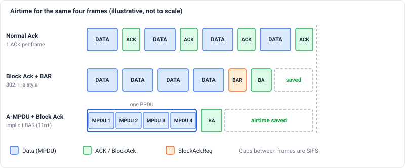
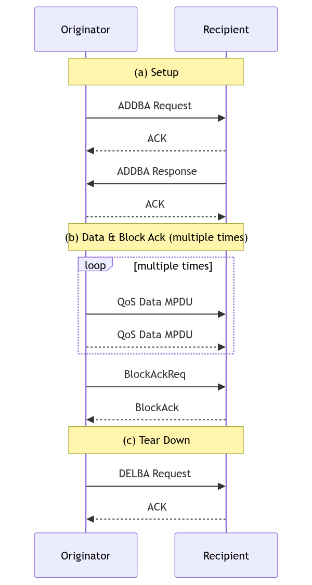
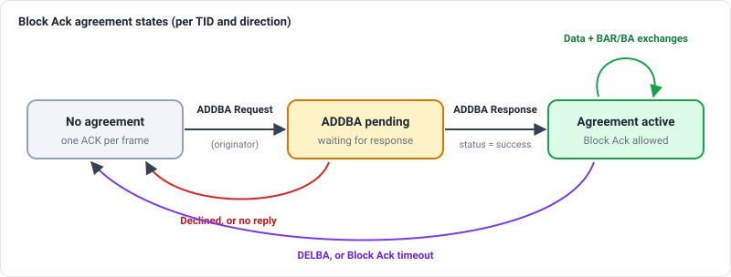
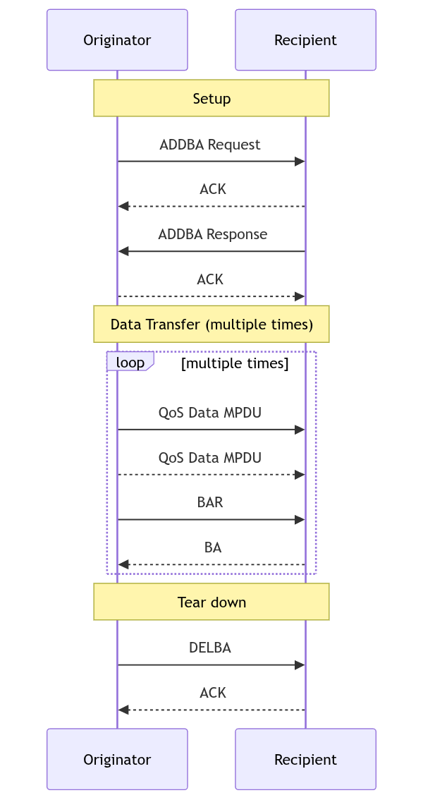
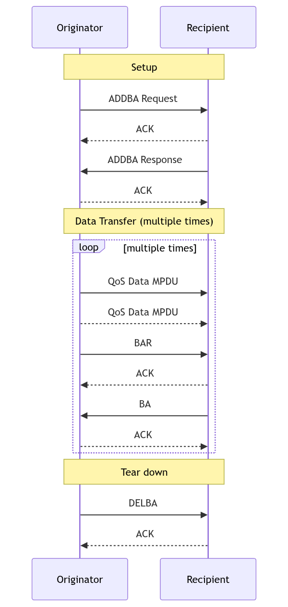
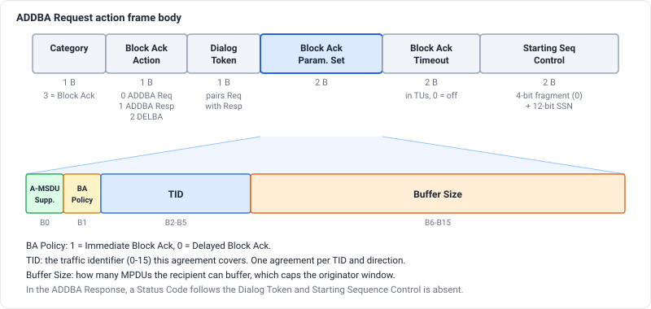
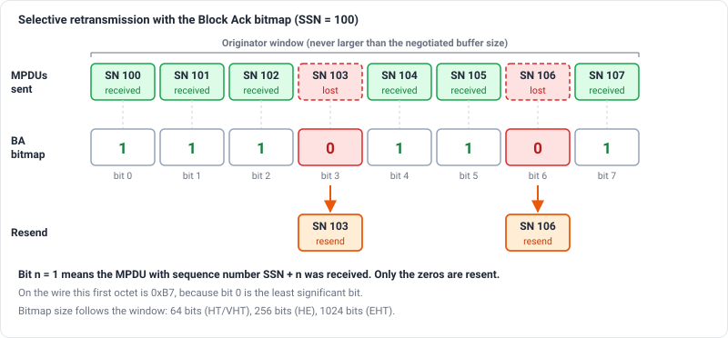
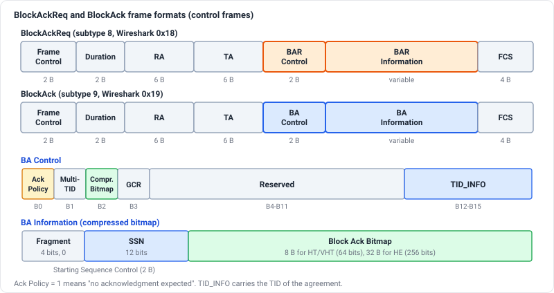

Block Ack lets a Wi-Fi device send many frames and receive a single acknowledgment for all of them. It is the mechanism that makes frame aggregation (A-MPDU) practical, so almost every high-throughput Wi-Fi link depends on it. This post covers how an agreement is set up, how the bitmap drives selective retransmission, and what to look for when it goes wrong.

---

### Why Block Ack

---

In classic 802.11 every unicast frame gets its own ACK. Each acknowledgment costs a SIFS, a PHY preamble and a response frame. At high PHY rates the payload itself is so short that this fixed overhead takes a large share of the airtime.

Block Ack, introduced in 802.11e, removes most of it. The originator sends a burst of frames and the recipient answers once. With A-MPDU (802.11n onwards) the whole burst travels in one PPDU, and the request for the acknowledgment is implicit.

A-MPDU aggregation relies on a Block Ack agreement for the traffic identifier (TID). If the agreement is missing, the link falls back to one frame per ACK and throughput drops sharply.

---

### Message Flow

---

A Block Ack agreement is negotiated once and then reused many times. There are two modes: immediate and delayed. Immediate Block Ack suits high-bandwidth, low-latency traffic. Delayed Block Ack suits devices that can tolerate moderate latency.

The life of an agreement has four steps:

1. **Setup:** the originator and recipient exchange ADDBA Request and ADDBA Response frames.
2. **Data:** the originator sends a block of QoS data frames. A block can start inside a polled TXOP or after the originator wins EDCA contention.
3. **Acknowledgment:** a BlockAckReq (BAR) frame asks for a BlockAck, which reports which MPDUs arrived. With A-MPDU the request is implicit. Steps 2 and 3 repeat for as long as there is traffic.
4. **Teardown:** a DELBA frame ends the agreement.

The agreement is a small state machine, kept separately for each TID and direction:

---

### Type of Block Ack

---

| Aspect          | Immediate Block Ack                                  | Delayed Block Ack |
|-----------------|------------------------------------------------------|-------------------|
| BlockAck timing | Sent after SIFS, right after the BAR (or A-MPDU)     | Sent later, in a separate TXOP |
| BAR handling    | BAR is answered directly by the BlockAck             | BAR is answered by a normal ACK first |
| Recipient needs | Fast hardware: must build the bitmap within SIFS     | Time to process, so slower or simpler devices work |
| Best for        | High throughput, low latency                         | Latency-tolerant traffic |
| In practice     | Used by essentially every HT, VHT, HE and EHT device | Rarely implemented |

---

#### Immediate Block Ack

---

---

#### Delayed Block Ack

---

---

### Setup

---

Before it asks for an agreement, the originator checks that the recipient supports Block Ack. Every HT, VHT, HE and EHT device supports the immediate mode, and the older capability bits cover the rest. When the check passes, the originator sends an ADDBA Request for one TID.

The recipient replies with an ADDBA Response and may accept or decline. A status code of 0 means success, and a non-zero status such as 37 means the request was declined. Once the response is accepted, a Block Ack agreement exists. It covers one TID in one direction, so a busy link usually holds several agreements. When to send the request is left to the implementation, and most drivers do it once enough traffic is queued for a TID.

The fields that matter most:

- **Buffer Size:** the number of MPDUs the recipient can hold. It limits both the originator's window and the number of frames in a block.
- **BA Policy:** 1 selects immediate, 0 selects delayed.
- **A-MSDU Supported:** whether the recipient accepts A-MSDUs inside the aggregated MPDUs.
- **Timeout:** the idle time (in TUs) after which the agreement lapses. A value of 0 disables the timeout.
- **Starting Sequence Number (SSN):** the first sequence number of the originator's window.

---

### Data & BlockAck

---

The originator sends QoS data frames with the Ack Policy field in the QoS Control field set to Block Ack. The frames are spaced a SIFS apart or packed into one A-MPDU. The block may not exceed the negotiated buffer size, and it must also fit the TXOP limit of the access category.

The recipient keeps a record of which sequence numbers it has received. When the originator asks for an acknowledgment, the recipient reports that record in a BlockAck frame.

---

#### The Block Ack Bitmap

---

The BlockAck frame carries a Starting Sequence Number and a bitmap. Bit n of the bitmap is 1 if the MPDU with sequence number SSN + n arrived. The originator resends only the MPDUs whose bit is 0, which is what makes the retransmission selective.

Sequence numbers are 12 bits long (0 to 4095), and all window arithmetic is done modulo 4096.

---

#### Frame Formats

---

BlockAckReq and BlockAck are control frames. In Wireshark they appear as subtypes 0x18 and 0x19, the same values used in the filter table of [Wi-Fi Overview](/blog/wifi-overview/).

---

#### Window and Reordering

---

The recipient delivers frames to the upper layer in sequence order. If one MPDU is missing, the frames behind it wait in the reorder buffer. They are released when the missing MPDU arrives, or when the window moves past it. The window moves in two ways: the originator gives up on an MPDU after its retry limit and sends newer frames, or it sends a BlockAckReq with a new starting sequence number.

This is why one stubborn lost frame can make traffic arrive in bursts. The throughput is still there, but the delivery stalls until the hole is resolved.

---

### Block Ack with A-MPDU

---

Since 802.11n, the usual operation is an A-MPDU followed by a BlockAck, with no explicit BAR. Sending an A-MPDU under a Block Ack agreement implicitly requests the acknowledgment, so the recipient answers after SIFS by itself. The explicit BlockAckReq is kept for recovery, for example when a BlockAck is lost, and for moving the window forward.

The window and the bitmap have grown with each generation:

| Standard | Wi-Fi generation | Maximum window | Bitmap size |
|----------|------------------|----------------|-------------|
| 802.11n  | Wi-Fi 4          | 64 MPDUs       | 64 bits (compressed) |
| 802.11ac | Wi-Fi 5          | 64 MPDUs       | 64 bits |
| 802.11ax | Wi-Fi 6          | 256 MPDUs      | 256 bits |
| 802.11be | Wi-Fi 7          | 1024 MPDUs     | 1024 bits |

A larger window lets an AP keep very wide channels busy, as covered in [Wi-Fi 7](/blog/wifi7/). It also needs more buffer memory on every client. Wi-Fi 6 also adds the Multi-STA BlockAck, which lets the AP acknowledge frames from several stations in one response after a Trigger-based uplink transmission.

---

### Teardown

---

When the originator has no more data and the last Block Ack exchange is done, it ends the agreement by sending a DELBA frame. Either side may send DELBA, and the Initiator bit says which side did. DELBA is not answered by a management frame, and the receiver simply releases the buffers it set aside for that agreement.

An agreement can also end without a DELBA. If the recipient sees no BlockAck, BlockAckReq or Block Ack-policy QoS data for the TID within the timeout negotiated in ADDBA, the agreement is torn down. Agreements are also lost when the station disassociates or roams to another AP, so the exchange starts again from ADDBA.

The reason code in DELBA tells you why:

| Reason code | Name           | Meaning |
|-------------|----------------|---------|
| 37          | END_BA         | The sender no longer wants to use the mechanism. This is the normal teardown |
| 38          | UNKNOWN_BA     | The sender received frames that need a Block Ack setup it does not have |
| 39          | TIMEOUT        | The agreement was idle for longer than the timeout |

---

### Troubleshooting

---

| Symptom                                  | Likely cause |
|------------------------------------------|--------------|
| Low throughput, no aggregation           | ADDBA was declined or never sent. Look for an ADDBA Response with a non-zero status code |
| ADDBA and DELBA repeating every few seconds | One side lost its state, for example after a driver reset, and answers with reason 38. Idle timeouts (reason 39) can look similar |
| Throughput dips after a roam             | Agreements are per association, so they must be set up again after reassociation. See [802.11r Fast Roaming](/blog/802_11r_fast_roaming/) |
| The same sequence number retried often   | The bitmap keeps showing the same hole: poor signal, interference or a hidden node |
| Traffic arrives in bursts                | A lost MPDU blocks the head of the recipient's reorder buffer |

Useful Wireshark filters:

| Purpose                           | Filter |
|-----------------------------------|--------|
| ADDBA and DELBA action frames     | `wlan.fc.type_subtype == 0x0d && wlan.fixed.category_code == 3` |
| BlockAckReq and BlockAck          | `wlan.fc.type_subtype in {0x18 0x19}` |
| BlockAck only                     | `wlan.fc.type_subtype == 0x19` |
| Retransmissions                   | `wlan.fc.retry == 1` |

---

### References

---

- IEEE Std 802.11-2020, Block Ack operation
- IEEE 802.11e-2005, which introduced Block Ack
- IEEE 802.11n-2009, which added A-MPDU, the compressed bitmap and implicit BAR
- IEEE 802.11ax-2021, which added the 256 window and Multi-STA BlockAck
- IEEE 802.11be, which added the 1024 window