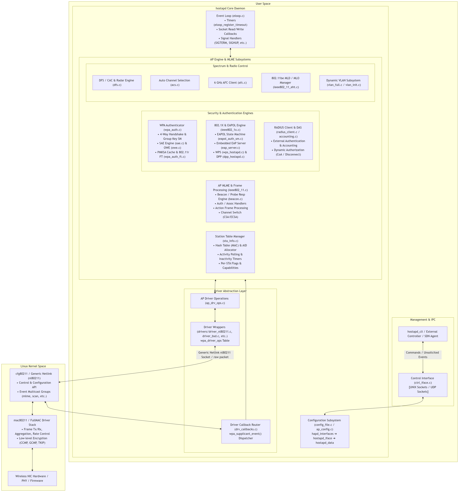
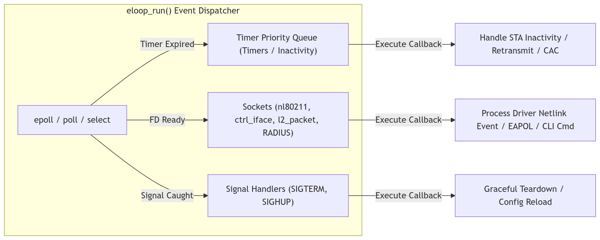
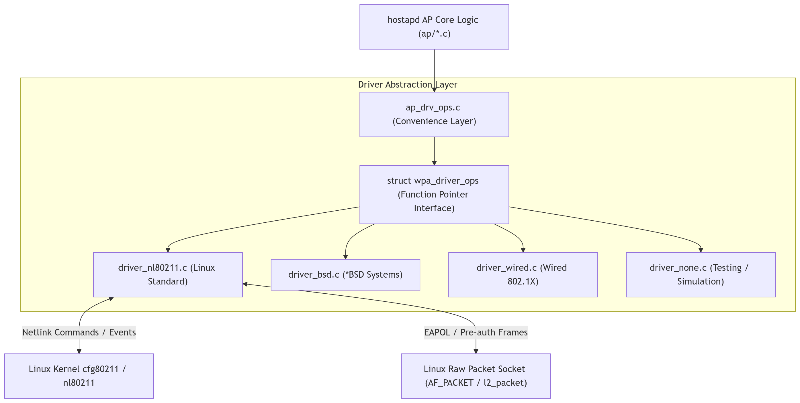
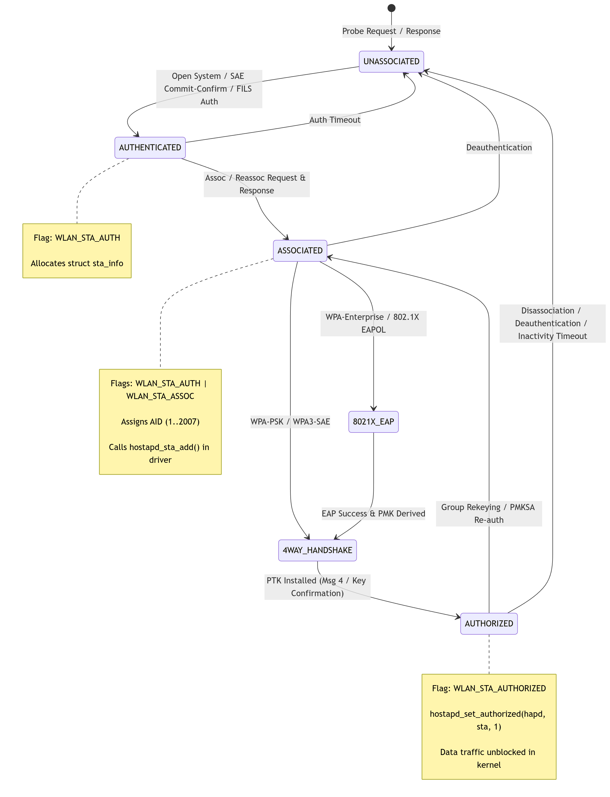
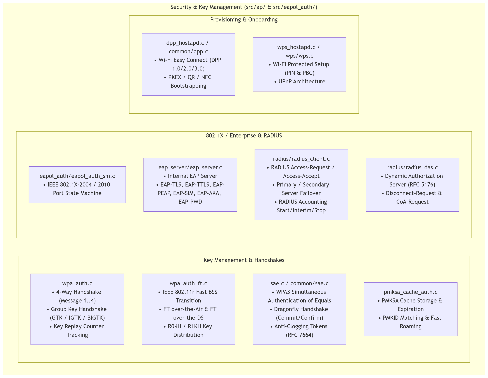
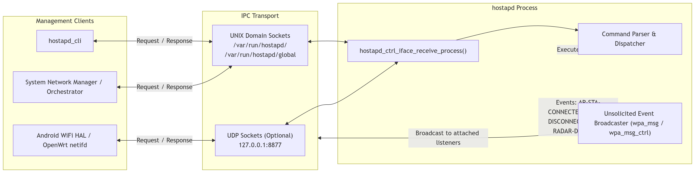
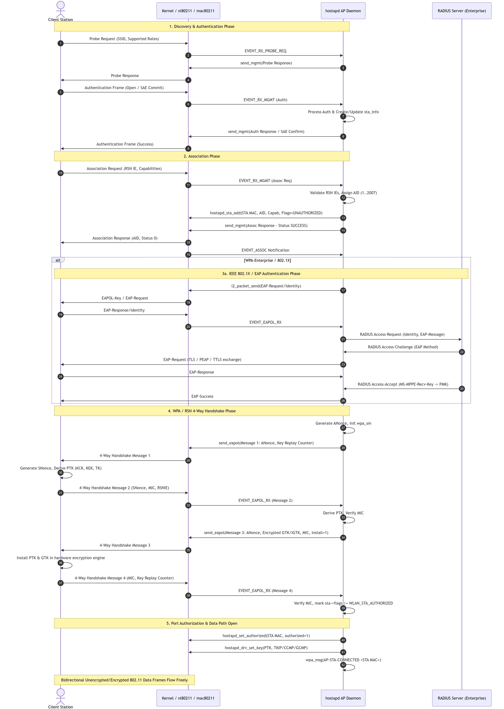
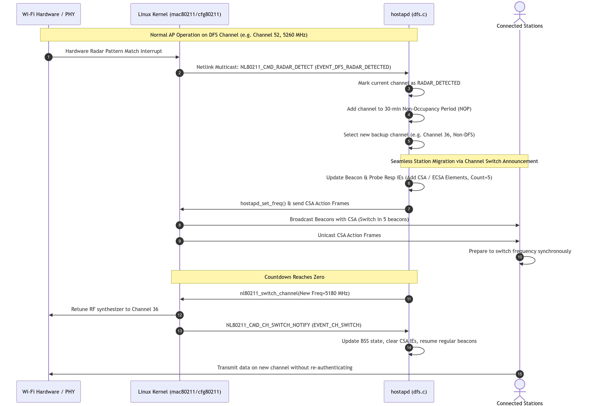

### Overview

**`hostapd`** (Host Access Point Daemon) is the industry-standard user-space daemon for managing wireless Access Points (APs) and IEEE 802.11 / IEEE 802.1X / WPA / WPA2 / WPA3 authentication and key management services on Linux and UNIX-like systems.

While modern wireless drivers and the Linux kernel (via `mac80211` / `cfg80211`) handle high-speed data path processing and real-time PHY/MAC layer frame transmission/reception, **`hostapd`** implements the upper-layer control plane, management plane, authentication state machines, and regulatory policy logic:

* **AP MLME (MAC Layer Management Entity)**: Management frame handling (Beacons, Probe Requests/Responses, Authentication, Association, Disassociation, Deauthentication, Action frames).
* **Security & Key Management**: WPA-Personal / WPA-Enterprise 4-Way Handshake, Group Key Handshake, SAE (WPA3-Personal), OWE, FILS, DPP (Easy Connect), PMKSA caching, and IEEE 802.11r Fast BSS Transition (FT).
* **IEEE 802.1X & RADIUS**: Complete EAP authenticator, embedded RADIUS authentication & accounting client, built-in RADIUS server, and Dynamic Authorization Extensions (RADIUS DAS / RFC 5176 CoA / Disconnect-Request).
* **Radio & Spectrum Management**: Automatic Channel Selection (ACS), Dynamic Frequency Selection (DFS / CAC / Radar handling), Automated Frequency Coordination (AFC for 6 GHz Standard Power), Channel Switch Announcements (CSA / ECSA), and BSS Color Change Announcements (CCA).
* **Advanced Multi-Generation Wi-Fi**: Multi-BSSID support, 802.11n (HT), 802.11ac (VHT), 802.11ax (HE / Wi-Fi 6/6E), 802.11be (EHT / Wi-Fi 7 Multi-Link Operation - MLD/MLO), Passpoint / Hotspot 2.0 (HS2.0 / GAS / ANQP), and RRM / WNM / MBO (802.11k/v/u).
* **Extensible Control & IPC**: UNIX domain socket and UDP socket-based control interfaces for `hostapd_cli`, orchestration daemons, and system network managers.

---

### High-Level Architectural Diagram



---

### Core Data Structure Hierarchy

The in-memory object model in `hostapd` follows a strict hierarchical design from daemon-wide global state down to individual connected stations:

```
[struct hapd_interfaces] (Daemon-level global manager)
  │
  ├── [struct hostapd_iface] (Per-Physical Radio / PHY context, e.g. phy0, wlan0)
  │     ├── hw_features / current_mode (802.11a/b/g/n/ac/ax/be, channel capabilities)
  │     ├── DFS / CAC state (HAPD_IFACE_DFS, HAPD_IFACE_ACS, HAPD_IFACE_ENABLED)
  │     ├── struct hostapd_config *conf (PHY & radio-wide configuration)
  │     │
  │     └── [struct hostapd_data **bss] (Array of Virtual BSS / SSIDs on this Radio)
  │           │
  │           ├── struct hostapd_bss_config *conf (BSS-specific configuration: SSID, WPA flags)
  │           ├── const struct wpa_driver_ops *driver & void *drv_priv
  │           ├── struct wpa_authenticator *wpa_auth (WPA state machine context)
  │           ├── struct eapol_authenticator *eapol_auth (802.1X context)
  │           ├── struct radius_client_data *radius
  │           ├── struct wps_context *wps / struct dpp_authentication *dpp_auth
  │           │
  │           └── [struct sta_info *sta_list] & [struct sta_info *sta_hash[256]]
  │                 │
  │                 ├── addr (MAC Address) & aid (Association ID: 1..2007)
  │                 ├── flags (WLAN_STA_AUTH, WLAN_STA_ASSOC, WLAN_STA_AUTHORIZED, etc.)
  │                 ├── struct wpa_state_machine *wpa_sm (Per-STA 4-way handshake state machine)
  │                 ├── struct eapol_state_machine *eapol_sm (Per-STA 802.1X state machine)
  │                 ├── struct sae_data *sae (WPA3-Personal SAE exchange state)
  │                 └── vlan_id / vlan_desc (Dynamic VLAN assigned to this station)
  │
  └── [struct hostapd_mld] (802.11be Multi-Link Device coordinator)
        ├── mld_addr (Common MLD MAC)
        └── struct dl_list links (List of affiliated hostapd_data BSS links across radios)
```

### Key Data Structures in Source Code

1. **[`struct hapd_interfaces`](hostapd-2.12/src/ap/hostapd.h#L50-L108)**:
   * Holds the list of physical radio interfaces (`struct hostapd_iface **iface`).
   * Manages the global control interface socket (`global_ctrl_sock`).
   * Contains global MLD entries (`struct hostapd_mld **mld`) for Wi-Fi 7 Multi-Link Operation.
   * Tracks global DPP contexts and process coordination.

2. **[`struct hostapd_iface`](hostapd-2.12/src/ap/hostapd.h#L576-L650)**:
   * Represents a physical wireless device (PHY/radio).
   * Manages radio state (`HAPD_IFACE_UNINITIALIZED`, `HAPD_IFACE_ACS`, `HAPD_IFACE_HT_SCAN`, `HAPD_IFACE_DFS`, `HAPD_IFACE_ENABLED`).
   * Contains the list of Virtual APs (`struct hostapd_data **bss`) hosted on this physical PHY.
   * Stores hardware capabilities (`struct hostapd_hw_modes *hw_features`).

3. **[`struct hostapd_data`](hostapd-2.12/src/ap/hostapd.h#L195-L534)**:
   * Represents an individual BSS (Basic Service Set / SSID).
   * Holds per-BSS security engines (`wpa_auth`, `eapol_auth`, `radius`, `wps`, `dpp`).
   * Contains the station table: linked list `sta_list` and hash table `sta_hash[256]` for O(1) MAC address lookups.
   * Manages AID (Association Identifier) bitfield bitmap `sta_aid[AID_WORDS]` (AIDs 1 through 2007).

4. **[`struct sta_info`](hostapd-2.12/src/ap/sta_info.h#L107-L300)**:
   * State container for an individual connected or connecting client station.
   * Tracks IEEE 802.11 state flags (`WLAN_STA_AUTH`, `WLAN_STA_ASSOC`, `WLAN_STA_AUTHORIZED`, `WLAN_STA_MFP`, `WLAN_STA_WMM`, `WLAN_STA_HT`, `WLAN_STA_VHT`, `WLAN_STA_HE`, `WLAN_STA_EHT`).
   * Embeds pointers to security state machines (`wpa_sm`, `eapol_sm`, `sae`).
   * Tracks dynamic VLAN assignments, accounting session statistics, and inactivity poll timers.

---

### Architectural Subsystem Deep Dive

#### Event Loop & Concurrency Model (`eloop`)

`hostapd` is engineered as a single-threaded, non-blocking, asynchronous event-driven daemon centered around **[`src/utils/eloop.c`](hostapd-2.12/src/utils/eloop.c)**.

* **I/O Multiplexing**: Utilizes `epoll_wait()`, `poll()`, or `select()` to monitor file descriptors for incoming network packets, Netlink socket events, and control socket connections without blocking.
* **Timer Management**: Implements scheduled delayed callbacks via `eloop_register_timeout(secs, usecs, handler, eloop_data, user_data)` and `eloop_cancel_timeout()`. These drive AP periodic tasks (`hostapd_periodic`), STA inactivity timeouts (`ap_handle_timer`), 4-way handshake retransmission timers, and DFS CAC timers.
* **Signal Dispatching**: Handles asynchronous OS signals (`SIGINT`, `SIGTERM`, `SIGHUP`, `SIGUSR1`) through signalfd or self-pipe notification routines to ensure thread-safe and interrupt-safe shutdowns and configuration reloads.
* **No Locking Overhead**: Because the entire state machine runs on a single event-driven thread, internal data structures (`sta_info`, `hostapd_data`) do not suffer from multi-threading mutex contention, race conditions, or deadlocks.



---

#### Configuration Subsystem

Configuration processing is handled by **[`hostapd/config_file.c`](hostapd-2.12/hostapd/config_file.c)** and **[`src/ap/ap_config.c`](hostapd-2.12/src/ap/ap_config.c)**:

* **Two-Level Configuration Hierarchy**:
  1. **Interface/PHY Level (`struct hostapd_config`)**: Channel, hardware mode (`hw_mode=a/b/g/n/ac/ax/be`), ACS parameters, country code, regulatory domain, DFS options.
  2. **BSS Level (`struct hostapd_bss_config`)**: SSID, BSSID, authentication suites (`wpa=1/2/3`), WPA key management (`wpa_key_mgmt=WPA-PSK WPA-EAP SAE`), encryption ciphers (`rsn_pairwise=CCMP GCMP`), RADIUS server IPs/secrets, VLAN configurations, and WPS settings.
* **Multi-BSSID & Multi-Interface Support**: A single configuration file can define multiple physical radios (`interface=wlan0`, `interface=wlan1`) and multiple BSS definitions on each radio (`bss=wlan0_0`, `bss=wlan0_1`).
* **Dynamic Reloading**: Supports runtime parameter updates via `SIGHUP` or `hostapd_cli reload` without restarting the daemon process.

---

#### Driver Abstraction Layer & Kernel Interfacing

`hostapd` is completely decoupled from driver-specific APIs via a unified Driver Abstraction Layer:



1. **[`struct wpa_driver_ops`](hostapd-2.12/src/drivers/driver.h#L1300-L2400)**: Defines over 150 standardized driver primitives (`set_ap`, `sta_add`, `sta_remove`, `set_key`, `send_mlme`, `set_freq`, `send_action`, `set_acl`, `channel_switch`, etc.).
2. **[`driver_nl80211.c`](hostapd-2.12/src/drivers/driver_nl80211.c)**:
   * Interacts with the Linux `cfg80211` subsystem using Generic Netlink (`NETLINK_GENERIC`).
   * Registers for frame filtering (Management frames: Probe Requests, Auth, Assoc, Action frames) and receives them over Netlink.
   * Subscribes to multicast Netlink groups (`nl80211` events: radar detected, low ACK, STA state change, scan complete).
3. **[`drv_callbacks.c`](hostapd-2.12/src/ap/drv_callbacks.c)**: Implements the central callback dispatcher [`wpa_supplicant_event()`](hostapd-2.12/src/ap/drv_callbacks.c#L2613-L3011) that translates kernel driver notifications (`EVENT_RX_MGMT`, `EVENT_ASSOC`, `EVENT_EAPOL_RX`, `EVENT_DFS_RADAR_DETECTED`, `EVENT_CH_SWITCH`) into internal `hostapd` core events.

---

#### Station Lifecycle & AP MLME Engine

The station management state machine is governed by **[`src/ap/ieee802_11.c`](hostapd-2.12/src/ap/ieee802_11.c)** and **[`src/ap/sta_info.c`](hostapd-2.12/src/ap/sta_info.c)**:



* **Management Frame Processing ([`ieee802_11_mgmt`](hostapd-2.12/src/ap/ieee802_11.c#L8156-L8290))**: Validates frame control, BSSID/DA matching, sequence numbers, and dispatches to specific handlers:
  * `WLAN_FC_STYPE_PROBE_REQ` ➔ `handle_probe_req()`
  * `WLAN_FC_STYPE_AUTH` ➔ `handle_auth()` (Open, Shared, SAE, FILS)
  * `WLAN_FC_STYPE_ASSOC_REQ` / `REASSOC_REQ` ➔ `handle_assoc()`
  * `WLAN_FC_STYPE_DISASSOC` ➔ `handle_disassoc()`
  * `WLAN_FC_STYPE_DEAUTH` ➔ `handle_deauth()`
  * `WLAN_FC_STYPE_ACTION` ➔ `handle_action()` (WMM, Block ACK, RRM, WNM, Protected Dual, DPP, FST)
* **Inactivity & Polling Engine**: Uses `ap_handle_timer()` to periodically poll inactive stations with data nullfunc frames. If unacknowledged, stations are transitioned to disassociated/deauthenticated states and cleaned up from driver memory.

---

#### Security, Key Management & Authentication Subsystems



#### Detailed Security Flows:
1. **WPA/WPA2/WPA3 4-Way Handshake**:
   * **Msg 1 (AP ➔ STA)**: AP generates `ANonce` and transmits to STA with Key Replay Counter.
   * **Msg 2 (STA ➔ AP)**: STA generates `SNonce`, calculates `PTK = PRF-X(PMK, "Pairwise key expansion", Min(AA,SPA) || Max(AA,SPA) || Min(ANonce,SNonce) || Max(ANonce,SNonce))`, and sends `SNonce` + MIC + RSN IE.
   * **Msg 3 (AP ➔ STA)**: AP verifies MIC, derives identical `PTK`, generates `GTK`/`IGTK`/`BIGTK`, sends encrypted group keys + MIC + install bit.
   * **Msg 4 (STA ➔ AP)**: STA confirms key installation with MIC. AP transitions station port to authorized (`hostapd_set_authorized`).
2. **SAE (WPA3-Personal Dragonfly Handshake)**:
   * Eliminates dictionary attacks by using a password-authenticated key exchange based on zero-knowledge proofs (RFC 7664 / IEEE 802.11az/REVme).
   * Implements anti-clogging tokens to defend against Denial-of-Service resource exhaustion attacks on elliptic curve math.
3. **802.11r Fast Transition (FT)**:
   * Derives a two-tier key hierarchy: `PMK-R0` (held by Mobility Domain Controller) ➔ `PMK-R1` (held by individual APs) ➔ `PTK`. Allows sub-50ms roaming without performing a full 802.1X/EAP re-authentication.

---

#### Radio Spectrum, DFS & Advanced PHY Features

* **Automatic Channel Selection ([`src/ap/acs.c`](hostapd-2.12/src/ap/acs.c))**:
  * Evaluates channel interference, noise floor, spectral survey statistics (`EVENT_GET_SURVEY`), and adjacent-channel overlapping BSS (OBSS) metrics to dynamically pick optimal 2.4 GHz, 5 GHz, or 6 GHz channels.
* **Dynamic Frequency Selection ([`src/ap/dfs.c`](hostapd-2.12/src/ap/dfs.c))**:
  * Manages radar detection regulations in 5 GHz UNII-2 / UNII-2 Extended bands.
  * Performs Channel Availability Check (CAC) before broadcasting beacons.
  * When a radar pulse is detected (`EVENT_DFS_RADAR_DETECTED`), initiates Channel Switch Announcement (CSA / ECSA) to smoothly migrate connected stations to a non-radar channel without disconnections, placing the affected channel into a 30-minute Non-Occupancy Period (NOP).
* **Automated Frequency Coordination ([`src/ap/afc.c`](hostapd-2.12/src/ap/afc.c))**:
  * Supports 6 GHz Standard Power APs by querying centralized AFC databases for allowed frequency ranges and Maximum Permissible EIRP powers based on geolocation.
* **802.11be Multi-Link Operation ([`src/ap/ieee802_11_eht.c`](hostapd-2.12/src/ap/ieee802_11_eht.c))**:
  * Coordinates multi-radio APs under a single Multi-Link Device (MLD) MAC address.
  * Affiliates individual `hostapd_data` instances across different frequency bands (2.4 GHz + 5 GHz + 6 GHz) under a unified `struct hostapd_mld` state machine.

---

#### Control Interface & IPC Architecture

`hostapd` provides a rich remote management and IPC framework implemented in **[`hostapd/ctrl_iface.c`](hostapd-2.12/hostapd/ctrl_iface.c)** and **[`src/ap/ctrl_iface_ap.c`](hostapd-2.12/src/ap/ctrl_iface_ap.c)**:



* **Control Interface Sockets**:
  * **Per-Interface Sockets (`/var/run/hostapd/wlan0`)**: Targets operations for a specific BSS (e.g. `STA`, `STATUS`, `DISASSOCIATE`, `GET_CONFIG`).
  * **Global Socket (`/var/run/hostapd/global`)**: Daemon-wide operations (e.g. `INTERFACE_ADD`, `INTERFACE_REMOVE`, `RELOAD`).
  * **MLD Socket (`/var/run/hostapd/mld0`)**: Wi-Fi 7 multi-link device coordination commands.
* **Event Notification Bus**: Clients send `ATTACH` to register for asynchronous event notifications (`AP-STA-CONNECTED`, `AP-STA-DISCONNECTED`, `WPS-PBC-ACTIVE`, `DFS-RADAR-DETECTED`, `EAP-SUCCESS`).

---

### End-to-End Operational Sequences

#### Station Association & WPA2/WPA3 4-Way Handshake Flow



---

### DFS Radar Detection & Channel Switch Announcement (CSA) Flow



---

## Source Tree Organization Reference Table

| Directory / File | Key Architectural Role | Primary Components & APIs |
| :--- | :--- | :--- |
| **[`hostapd/main.c`](hostapd-2.12/hostapd/main.c)** | Main Daemon Entry Point | `main()`, argument parsing, daemonization, `hostapd_global_init()`, `hostapd_global_run()`. |
| **[`hostapd/config_file.c`](hostapd-2.12/hostapd/config_file.c)** | Configuration File Parser | Parses `hostapd.conf`, multi-BSS blocks, security modes, and rates. |
| **[`hostapd/ctrl_iface.c`](hostapd-2.12/hostapd/ctrl_iface.c)** | Daemon IPC Server | UNIX domain socket & UDP request handling, `hostapd_cli` command execution. |
| **[`src/ap/hostapd.c`](hostapd-2.12/src/ap/hostapd.c)** | AP Lifecycle Management | `hostapd_setup_interface()`, `hostapd_enable_iface()`, `hostapd_reload_config()`. |
| **[`src/ap/ieee802_11.c`](hostapd-2.12/src/ap/ieee802_11.c)** | AP MLME & Frame Processing | `ieee802_11_mgmt()`, `handle_auth()`, `handle_assoc()`, `handle_action()`. |
| **[`src/ap/sta_info.c`](hostapd-2.12/src/ap/sta_info.c)** | Station Table Manager | `ap_get_sta()`, `ap_sta_add()`, `ap_sta_hash_add()`, AID allocation, inactivity timers. |
| **[`src/ap/wpa_auth.c`](hostapd-2.12/src/ap/wpa_auth.c)** | WPA/RSN Authenticator | 4-Way Handshake, Group Key Handshake, PTK/GTK/IGTK derivation. |
| **[`src/ap/wpa_auth_ft.c`](hostapd-2.12/src/ap/wpa_auth_ft.c)** | 802.11r Fast Transition | FT over-the-air, FT over-the-DS, R0KH / R1KH key exchange. |
| **[`src/ap/beacon.c`](hostapd-2.12/src/ap/beacon.c)** | Beacon Generator | Information Elements (IE) construction, TIM bitmap, CSA/ECSA injection. |
| **[`src/ap/dfs.c`](hostapd-2.12/src/ap/dfs.c)** | Dynamic Frequency Selection | Radar detection handling, CAC timers, Non-Occupancy Period (NOP) enforcement. |
| **[`src/ap/acs.c`](hostapd-2.12/src/ap/acs.c)** | Auto Channel Selection | Spectrum scanning, survey data analysis, channel scoring algorithm. |
| **[`src/ap/afc.c`](hostapd-2.12/src/ap/afc.c)** | 6 GHz Standard Power AFC | Automated Frequency Coordination client for 6 GHz regulatory authorization. |
| **[`src/ap/ieee802_11_eht.c`](hostapd-2.12/src/ap/ieee802_11_eht.c)** | Wi-Fi 7 / 802.11be MLO | Multi-Link Device (MLD) link management, EHT capabilities, partner link sync. |
| **[`src/ap/vlan_init.c`](hostapd-2.12/src/ap/vlan_init.c)** | Dynamic VLAN Subsystem | 802.1Q tagging, bridge interfaces, per-user dynamic VLAN assignment. |
| **[`src/ap/drv_callbacks.c`](hostapd-2.12/src/ap/drv_callbacks.c)** | Kernel Event Dispatcher | `wpa_supplicant_event()` event router from driver to hostapd core. |
| **[`src/ap/ap_drv_ops.c`](hostapd-2.12/src/ap/ap_drv_ops.c)** | AP Driver Operation Wrappers | Common wrapper routing high-level AP requests to driver function pointers. |
| **[`src/drivers/driver_nl80211.c`](hostapd-2.12/src/drivers/driver_nl80211.c)** | Linux nl80211 Driver Wrapper | Generic Netlink (`nl80211`) communications, socket management, raw packet Tx/Rx. |
| **[`src/radius/`](hostapd-2.12/src/radius/)** | RADIUS Client & Server | RADIUS authentication, accounting, and Dynamic Authorization (DAS / CoA). |
| **[`src/eapol_auth/`](hostapd-2.12/src/eapol_auth/)** | 802.1X Authenticator | IEEE 802.1X Port Access Entity (PAE) state machine implementation. |
| **[`src/eap_server/`](hostapd-2.12/src/eap_server/)** | Integrated EAP Server | EAP-TLS, EAP-TTLS, EAP-PEAP, EAP-SIM, EAP-AKA, EAP-PWD, EAP-FAST. |
| **[`src/utils/eloop.c`](hostapd-2.12/src/utils/eloop.c)** | Asynchronous Event Loop | epoll/poll/select I/O multiplexing, timeouts, signal handling. |
| **[`src/utils/wpabuf.c`](hostapd-2.12/src/utils/wpabuf.c)** | Resizable Buffer Library | Safe dynamic byte buffer manipulation for frame creation and parsing. |

---

## Summary & Architectural Strengths

1. **Clean Separation of Concerns**: High-frequency data plane encryption and transmission reside inside the kernel (`mac80211`/firmware), while complex management state machines and policy decisions reside in user space (`hostapd`).
2. **Deterministic Concurrency**: The asynchronous, single-threaded `eloop` design completely eliminates concurrency deadlocks and multi-threading race conditions while handling thousands of simultaneous stations.
3. **Pluggable & Portable Architecture**: Abstract driver interfaces (`wpa_driver_ops`) allow identical AP management logic to operate across Linux (`nl80211`), BSD, Windows, wired MACsec switches, or software simulation testbeds.
4. **Comprehensive Standards Compliance**: Implements the complete lifecycle of IEEE 802.11 standards from legacy 802.11a/b/g up to modern 802.11ax (Wi-Fi 6/6E) and 802.11be (Wi-Fi 7 Multi-Link Operation).