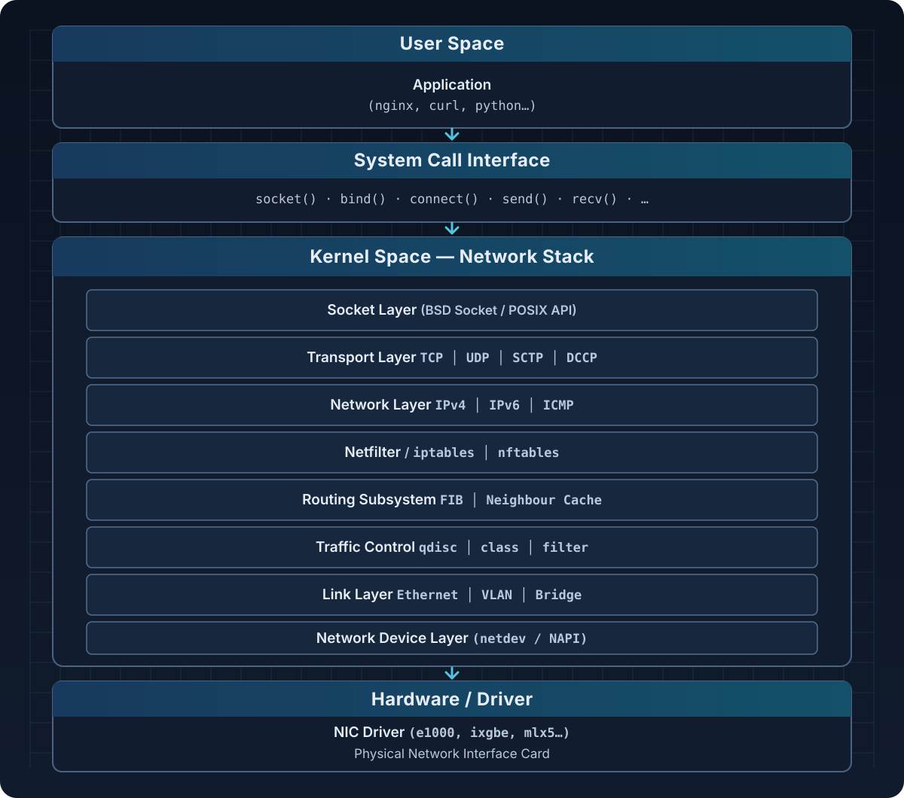

### Architectural Overview

---

The Linux network stack is the most complex subsystem within the Linux kernel, responsible for the entire packet processing workflow from the moment the NIC receives data until the application reads it.

---

#### Layered Model

---



---

### Packet Path

---

#### Receive Direction (RX — Ingress)

---

```
Hardware NICs 
  → Interrupt / NAPI poll 
  → sk_buff allocation 
  → Ethernet frame processing 
  → IP routing lookup 
  → Netfilter hooks (PREROUTING, INPUT) 
  → Transport layer (TCP/UDP) 
  → Socket receive buffer 
  → Application read()
```

---

#### Egress (TX — Egress)

---

```
Application write() / send() 
  → Socket send buffer 
  → Transport layer (TCP segmentation, UDP encap) 
  → IP header attached 
  → Netfilter hooks (OUTPUT, POSTROUTING) 
  → Routing decisions 
  → Traffic Control (qdisc) 
  → NIC driver TX queue 
  → DMA → Hardware NIC → Wire
```

---

### Layers of the Network Stack 

---

#### sk_buff (Socket Buffer) Structure

---

`sk_buff` (abbreviated as **skb**) is the central data structure of the Linux network stack. Every packet is represented as an `sk_buff`.

```c
struct sk_buff {
    /* Linked list */
    struct sk_buff      *next; 
    struct sk_buff      *prev; 

    /* Timestamps */
    ktime_t             tstamp; 

    /* Network device */
    struct net_device   *dev; 

    /* Data pointers */
    unsigned char       *head; /* Start of allocated memory    */
    unsigned char       *data; /* Start of actual data         */
    unsigned char       *tail; /* End of actual data           */
    unsigned char       *end; /* End of allocated memory      */

    /* Lengths */
    unsigned int        len; /* Total length (head + frags)  */
    unsigned int        data_len;/* Length of fragment part      */
    __u16               mac_len; /* MAC header length            */
    __u16               hdr_len; /* Header length (clone)        */

    /* Checksums */
    __wsum              csum; 
    __u8   ​​             ip_summed; 

    /* Routing */
    struct dst_entry    *dst; 

    /* Netfilter */
    __u32               nfmark; 

    /* Protocol */
    __be16              protocol; 

    /* ... many other fields ... */
};
```

---

##### Key operations on skb

---

| Function | Meaning |
|-----|---------|
| `alloc_skb(size, gfp)` | Allocate a new skb |
| `kfree_skb(skb)` | Free an skb |
| `skb_put(skb, len)` | Extend the tail area (add data) |
| `skb_push(skb, len)` | Extend the head area (add header) |
| `skb_pull(skb, len)` | Shrink the head area (remove header) |
| `skb_trim(skb, len)` | Shrink the tail area |
| `skb_clone(skb, gfp)` | Clone an skb (share data) |
| `skb_copy(skb, gfp)` | Copy the entire skb |
| `skb_linearize(skb)` | Flatten fragments into a contiguous buffer |

---

### Socket Layer

---

#### BSD Socket Interface

---

The kernel provides the BSD socket API via `struct proto_ops` and `struct proto`:

```c
/* net/socket.c */
struct socket { 
    socket_state state; /* SS_FREE, SS_UNCONNECTED, SS_CONNECTED… */ 
    short type; /* SOCK_STREAM, SOCK_DGRAM, SOCK_RAW… */ 
    unsigned long flags; 
    struct file *file; 
    struct sock *sk; /* Pointer to inet_sock / tcp_sock… */ 
    const struct proto_ops *ops; /* Virtual function table: connect, bind… */
};
```

---

#### TCP Socket Lifecycle

---

```
CLOSED
│  socket()
▼
LISTEN ──────────── bind() + listen()
│  accept()
▼
SYN_RCVD ◄──────── SYN received (server)
│  SYN+ACK sent
▼
ESTABLISHED ◄────── ACK received
│  send() / recv() data exchange
▼
FIN_WAIT_1 ──────── close() (active close)
│  FIN sent
▼
FIN_WAIT_2 ──────── ACK received
│  FIN received from peer
▼
TIME_WAIT ──────────── 2*MSL wait
│
▼
CLOSED
```

---

#### Socket Buffer Management

---

```
Receive Buffer (sk_rcvbuf):
┌────────────────────────────────────┐
│  sk_receive_queue (skb queue)      │
│  [skb1][skb2][skb3]…               │
│                                    │
│  sk_rmem_alloc ≤ sk_rcvbuf         │
└────────────────────────────────────┘

Send Buffer (sk_sndbuf):
┌────────────────────────────────────┐
│  sk_write_queue (skb queue)        │
│  [skb1][skb2][skb3]…               │
│                                    │
│  sk_wmem_queued ≤ sk_sndbuf        │
└────────────────────────────────────┘
```

---

### Transport Layer — TCP & UDP

---

#### TCP Control Block

---

```c
struct tcp_sock {
    struct inet_connection_sock inet_conn; /* must be the first member */

    /* Sequence numbers */
    u32     rcv_nxt; /* Next sequence number expected to be received */
    u32     snd_nxt; /* Next sequence number to be sent              */
    u32     snd_una; /* Unacknowledged sequence number               */
    u32     snd_wnd; /* Send window from peer                        */
    u32     rcv_wnd; /* Current receive window                       */

    /* Congestion Control */
    u32     snd_cwnd; /* Congestion window                            */
    u32     ssthresh; /* Slow-start threshold                         */
    u32     snd_ssthresh; 

    /* RTT estimation */
    u32     srtt_us; /* Smoothed RTT (microseconds, scaled)          */
    u32     mdev_us; /* Mean deviation of RTT                        */
    u32     rto; /* Retransmission timeout                       */

    /* Timestamps */
    u32     rcv_tsval; /* Timestamp value from peer                    */
    u32     rcv_tsecr; /* Timestamp echo reply from peer               */

    /* ... */
};
```

---

#### TCP Congestion Control

---

Linux supports multiple congestion control algorithms via a pluggable framework:

```bash
# View the algorithm currently in use
sysctl net.ipv4.tcp_congestion_control

# List all available algorithms
sysctl net.ipv4.tcp_available_congestion_control

# Change the algorithm
sysctl -w net.ipv4.tcp_congestion_control=bbr
```

| Algorithm | Description |
|-----------|-------|
| `cubic` | Default. Uses a cubic function for cwnd. Suitable for high-bandwidth, high-latency links. |
| `bbr` | Bottleneck Bandwidth and RTT — developed by Google. Optimizes throughput; performs better in bufferbloat-prone environments. |
| `reno` | Classic TCP Reno — simple, loss-based. |
| `htcp` | Hamilton TCP — suitable for high-speed networks. |
| `vegas` | Delay-based congestion control. |
| `dctcp` | Data Center TCP — for data center environments. |

---

#### TCP Fast Path vs Slow Path

---

```
Incoming TCP packet
│
▼
tcp_v4_rcv()
│
├─► [SYN] → tcp_conn_request()          (connection setup)
│
├─► [Fast Path] tcp_rcv_established()
│       Conditions:
│       - Connection is ESTABLISHED
│       - No out-of-order packets
│       - No window probe
│       - Valid sequence number
│       └─► Fast processing: update rcv_nxt, send ACK
│
└─► [Slow Path] tcp_data_queue()
Processing: reordering, SACK, urgent data…
```

---

#### UDP Processing

---

UDP is much simpler — connectionless, with no ordering guarantees:

```c
/* RX path */
udp_rcv()
→ __udp4_lib_rcv()
→ udp4_lib_lookup()    /* Find socket */
→ udp_queue_rcv_one_skb()
→ __udp_queue_rcv_skb()
→ sock_queue_rcv_skb()   /* Add to receive queue */
```

---

### Network Layer — IP

---

#### IPv4 Header

---

```
 0                   1                   2                   3
 0 1 2 3 4 5 6 7 8 9 0 1 2 3 4 5 6 7 8 9 0 1 2 3 4 5 6 7 8 9 0 1
┌─┬─┬─┬─┬─┬─┬─┬─┬─┬─┬─┬─┬─┬─┬─┬─┬─┬─┬─┬─┬─┬─┬─┬─┬─┬─┬─┬─┬─┬─┬─┬─┐
│ Version │  IHL  │   DSCP    │ECN│           Total Length      │
├─────────────────┼───────────────────────┼─┬─┬─────────────────┤
│         Identification                  │R│D│F│Fragment Offset│
├─────────────────┴───────────────────────┴─┴─┴─────────────────┤
│      TTL        │    Protocol           │ Header Checksum     │
├───────────────────────────────────────────────────────────────┤
│                        Source IP Address                      │
├───────────────────────────────────────────────────────────────┤
│                     Destination IP Address                    │
├───────────────────────────────────────────────────────────────┤
│                      Options ( if IHL > 5)                    │
└───────────────────────────────────────────────────────────────┘
```

---

#### IP Receive Path

---

```c
ip_rcv()                    /* Entry point from L2 */
  → ip_rcv_core()           /* check header, checksum */
  → NF_HOOK(PREROUTING)     /* Netfilter hook */
  → ip_rcv_finish()
    → ip_route_input_noref() /* Routing lookup */
    │
    ├─► ip_local_deliver()   /* Packet for local */
    │     → NF_HOOK(INPUT)
    │     → ip_local_deliver_finish()
    │       → tcp_v4_rcv() / udp_rcv() / ...
    │
    └─► ip_forward()         /* Forwarding */
          → NF_HOOK(FORWARD)
          → ip_output()
```

---

#### IP Fragmentation & Reassembly

---

```
Fragmentation (If packet > MTU):
┌─────────────────────────┐
│   Original IP Packet    │  > MTU (e.g. 1500 bytes)
│   [IP Header][Payload]  │
└─────────────────────────┘
         │ ip_fragment()
         ▼
┌────────────┐ ┌────────────┐ ┌────────────┐
│ [IPH][Frag1│ │ [IPH][Frag2│ │ [IPH][Frag3│
│  MF=1 O=0  │ │  MF=1 O=185│ │  MF=0 O=370│
└────────────┘ └────────────┘ └────────────┘
  (More Frag)   (More Frag)   (Last Frag)

Reassembly:
ip_defrag() use ipq (ip_defrag_queue) to clone
Timeout: net.ipv4.ipfrag_time (mặc định: 30 giây)
```

---

### Link Layer & Network Device

---

#### NAPI (New API)

---

NAPI is a mechanism that combines interrupt-driven processing and polling to handle packets efficiently at high speeds:

```
Packet arrives at the NIC
    │
    ├─► [Low speed] Hard IRQ → netif_rx() → Immediate processing
    │
    └─► [High speed] Hard IRQ → disable interrupts → schedule NAPI poll
                                    │
                                    ▼
                            NET_RX_SOFTIRQ
                                    │
                                    ▼
                            napi_poll() / driver->poll()
                            (batch processing — budget)
                                    │
                            Budget exhausted or queue empty
                                    │
                                    ▼
                            Re-enable the interrupt.
```

---

##### NAPI Structure

---

```c
struct napi_struct {
    struct list_head    poll_list;   /* Danh sách NAPI cần poll    */
    unsigned long       state;       /* NAPI_STATE_SCHED, …        */
    int                 weight;      /* Budget mặc định = 64       */
    int                 (*poll)(struct napi_struct *, int); /* Driver poll function */
    struct net_device   *dev;
    /* … */
};
```

---

#### Ring Buffer

---

```
TX Ring Buffer:
   Head (driver write)
    │
    ▼
┌──────┬──────┬──────┬──────┬──────┐
│ Desc │ Desc │ Desc │ Desc │ Desc │  ← Ring (circular)
│  0   │  1   │  2   │  3   │  4   │
└──────┴──────┴──────┴──────┴──────┘
                              ▲
                              │
                           Tail (NIC read)

RX Ring Buffer:
   Head (NIC write)
    │
    ▼
┌──────┬──────┬──────┬──────┬──────┐
│ Desc │ Desc │ Desc │ Desc │ Desc │
│  0   │  1   │  2   │  3   │  4   │
└──────┴──────┴──────┴──────┴──────┘
                              ▲
                              │
                           Tail (driver read)
```

---

#### Virtual Network Devices

---

| Type | Description | Create command |
|-------|-------|----------|
| `veth` | Virtual Ethernet pair (pipe between namespaces) | `ip link add veth0 type veth peer name veth1` |
| `bridge` | L2 bridge | `ip link add br0 type bridge` |
| `vlan` | 802.1Q VLAN tagging | `ip link add eth0.100 link eth0 type vlan id 100` |
| `macvlan` | Multiple MAC on 1 NIC | `ip link add mv0 link eth0 type macvlan mode bridge` |
| `ipvlan` | Multiple IP, same MAC | `ip link add iv0 link eth0 type ipvlan mode l3` |
| `tun` | L3 tunnel (IP packets) | `ip tuntap add tun0 mode tun` |
| `tap` | L2 tunnel (Ethernet frames) | `ip tuntap add tap0 mode tap` |
| `dummy` | Fake Loopback | `ip link add dummy0 type dummy` |
| `bonding` | Link aggregation | `ip link add bond0 type bond` |

---

### Netfilter & iptables

---

#### Netfilter Hooks

---

Netfilter defines 5 hook points in the packet path:

```
                         ROUTING
                        DECISION
                            │
Packet IN                   │                    Packet OUT
──────────►  PREROUTING ────┤──── FORWARD ────►  POSTROUTING ──────►
                            │
                            │
                          INPUT                    OUTPUT
                            │                       ▲
                            ▼                       │
                      LOCAL PROCESS ────────────────┘
```

| Hook | Position | Application |
|------|--------|----------|
| `PREROUTING` | Before routing | DNAT, connection tracking |
| `INPUT` | Packets destined for local | Inbound firewall |
| `FORWARD` | Packets being forwarded | Forwarding firewall |
| `OUTPUT` | Packets originating locally | Outbound firewall, SNAT |
| `POSTROUTING` | After routing | SNAT, Masquerade |

---

#### iptables Tables

---

```
Table: filter (default) 
    Chains: INPUT, FORWARD, OUTPUT 
    Used for: Firewall, packet filtering

Table: nat 
    Chains: PREROUTING, INPUT, OUTPUT, POSTROUTING 
    Used for: NAT, port forwarding, masquerade

Table: mangle 
    Chains: PREROUTING, INPUT, FORWARD, OUTPUT, POSTROUTING 
    Used for: Modifying headers (TTL, TOS, MARK)

Table: raw 
    Chains: PREROUTING, OUTPUT 
    Used for: Bypass connection tracking (NOTRACK)

Table: security 
    Chains: INPUT, FORWARD, OUTPUT 
    Used for: SELinux/AppArmor marking
```

---

##### Table processing order at each hook

---

```
PREROUTING:   raw → mangle → nat
INPUT:        mangle → filter → security → nat
FORWARD:      mangle → filter → security
OUTPUT:       raw → mangle → nat → filter → security
POSTROUTING:  mangle → nat
```

---

#### Example iptables

---

```bash
# Allow traffic established/related
iptables -A INPUT -m conntrack --ctstate ESTABLISHED,RELATED -j ACCEPT

# Allow SSH from specific network
iptables -A INPUT -s 192.168.1.0/24 -p tcp --dport 22 -j ACCEPT

# DNAT: Forward port 8080 → 80 on local machine
iptables -t nat -A PREROUTING -p tcp --dport 8080 \ 
-j DNAT --to-destination 10.0.0.5:80

# Masquerade (dynamic SNAT for outbound traffic)
iptables -t nat -A POSTROUTING -o eth0 -j MASQUERADE

# Rate limiting (simple DDoS protection)
iptables -A INPUT -p tcp --dport 80\ 
-m limit --limit 100/min --limit-burst 200 -j ACCEPT

# Log and drop
iptables -A INPUT -j LOG --log-prefix "IPTables-DROP: " --log-level 4
iptables -A INPUT -j DROP
```

---

#### nftables 

---

```bash
# Create tables and chains
nft add table inet myfilter
nft add chain inet myfilter input { type filter hook input priority 0 \; }

# Add rules
nft add rule inet myfilter input ct state established,related accept
nft add rule inet myfilter input tcp dport 22 accept
nft add rule inet myfilter input drop

# See ruleset
nft list ruleset
```

---

### Routing Subsystem

---

#### FIB (Forwarding Information Base)

---

Linux uses **FIB Trie** (LC-Trie) for efficient route lookup:

```bash
# View routing table
ip route show
ip route show table all

# View FIB trie statistics
cat /proc/net/fib_triestat

# Trace route lookup
ip route get 8.8.8.8
# output: 8.8.8.8 via 192.168.1.1 dev eth0 src 192.168.1.100
```

---

#### Policy Routing (Multiple Tables)

---

```bash
# Default routing tables
# 0   = UNSPEC
# 253 = default
# 254 = main  ← 'ip route show' displays this table
# 255 = local (loopback, broadcast)

# Create a custom routing table (/etc/iproute2/rt_tables)
echo "100 custom_table" >> /etc/iproute2/rt_tables

# Add a route to the custom table
ip route add default via 10.0.0.1 table custom_table

# Add a policy rule: traffic from 10.0.0.0/24 uses the custom table
ip rule add from 10.0.0.0/24 table custom_table priority 100

# View all policy rules
ip rule list
```

---

#### Neighbour Subsystem (ARP/NDP)

---

```
IP destination found in routing table
    │
    ▼
Cần MAC address of next-hop
    │
    ├─► [Cache hit] neigh_lookup() → MAC exist → send packet
    │
    └─► [Cache miss] ARP request broadcast
             │
             ▼
         Chờ ARP reply (neigh state: INCOMPLETE)
             │
             ▼
         neigh state: REACHABLE (timeout: 30s default)
             │
             ▼
         Timeout → STALE → DELAY → PROBE → FAILED
```

```bash
# view ARP cache
ip neigh show
arp -n

# add ARP static entry
ip neigh add 192.168.1.1 lladdr aa:bb:cc:dd:ee:ff dev eth0

# Flush ARP cache
ip neigh flush dev eth0
```

---

### Traffic Control (tc/qdisc)

---

#### TC Architecture

---

```
Egress (Outbound):
                   ┌──────────────────┐
skb from network   │   Root qdisc     │
layer ─────────►   │  (e.g. HTB/HFSC) │
                   │                  │
                   │  ┌───┐  ┌───┐    │
                   │  │cls│  │cls│    │  ← Classifiers
                   │  └───┘  └───┘    │
                   │    │       │     │
                   │  ┌───┐  ┌───┐    │
                   │  │cls│  │cls│    │  ← Leaf qdiscs (pfifo, tbf…)
                   └──────────────────┘
                           │
                           ▼ → NIC TX queue
```

---

#### Common qdiscs

---

| qdisc | Type | Description |
|-------|------|-------|
| `pfifo_fast` | Classless | Default prior to Linux 5.15. 3 priority bands. |
| `fq_codel` | Classless | Fair Queueing + CoDel AQM. Effective at reducing bufferbloat. |
| `fq` | Classless | Fair Queue — used with TCP BBR. |
| `tbf` | Classless | Token Bucket Filter — rate limiting. |
| `htb` | Classful | Hierarchical Token Bucket — hierarchical bandwidth sharing. |
| `hfsc` | Classful | Hierarchical Fair Service Curve — guarantees latency and bandwidth. |
| `cake` | Classless | CAKE (Common Applications Kept Enhanced) — next-generation fq_codel. |
| `netem` | Classless | Network Emulator — simulates delay, loss, and jitter (for testing). |

---

#### Example tc

---

```bash
# Limit bandwidth with TBF (10 Mbit/s)
tc qdisc add dev eth0 root tbf rate 10mbit burst 32kbit latency 400ms

# HTB with 2 classes
tc qdisc add dev eth0 root handle 1: htb default 20

# Root class (100 Mbit)
tc class add dev eth0 parent 1: classid 1:1 htb rate 100mbit

# High priority: guaranteed 50 Mbit (web traffic)
tc class add dev eth0 parent 1:1 classid 1:10 htb rate 50mbit ceil 100mbit prio 1

# Low priority: guaranteed 10 Mbit (bulk traffic)
tc class add dev eth0 parent 1:1 classid 1:20 htb rate 10mbit ceil 100mbit prio 2

# Classifier: DSCP CS3 → class 1:10
tc filter add dev eth0 protocol ip parent 1:0 prio 1 \ 
u32 match ip tos 0x60 0xff flowid 1:10

# Emulate poor network (100ms delay, 1% loss) with netem
tc qdisc add dev eth0 root netem delay 100ms loss 1%
```

---

### Network Namespaces

---

Network namespace cho phép tạo môi trường mạng cô lập hoàn toàn — dùng trong containers (Docker, Kubernetes).

---

#### Isolated Resources

---

Each network namespace has its own: network interfaces, routing tables, iptables rules, ARP cache, netfilter state, sockets.

---

#### Working with Network Namespaces

---

```bash
# Create a namespace
ip netns add ns1

# List namespaces
ip netns list

# Execute a command within the namespace
ip netns exec ns1 ip link show
ip netns exec ns1 bash   # Open a shell inside the namespace

# Create a veth pair
ip link add veth0 type veth peer name veth1

# Move veth1 into ns1
ip link set veth1 netns ns1

# Configure the host side
ip addr add 10.10.0.1/24 dev veth0
ip link set veth0 up

# Configure the namespace side
ip netns exec ns1 ip addr add 10.10.0.2/24 dev veth1
ip netns exec ns1 ip link set veth1 up
ip netns exec ns1 ip link set lo up

# Test connectivity
ip netns exec ns1 ping 10.10.0.1

# Delete the namespace
ip netns del ns1
```

---

#### Container Networking Diagram (Docker Bridge Mode)

---

```
Host Network Namespace
┌─────────────────────────────────────────────────────┐
│                                                     │
│  eth0 (physical)   docker0 (bridge, 172.17.0.1)     │
│  192.168.1.100      │                               │
│       │             │──────────────────────┐        │
│       │             │                      │        │
│    [NAT/MASQ]    veth_A                 veth_B      │
│                    │                      │         │
└────────────────────┼──────────────────────┼─────────┘
                     │                      │
Container A NS       │              Container B NS
┌────────────────┐   │         ┌────────────────┐
│  eth0          │◄──┘         │  eth0          │◄──┘
│ 172.17.0.2/16  │             │ 172.17.0.3/16  │
└────────────────┘             └────────────────┘
```

---

### Performance Optimization Mechanisms

---

#### TCP Offloading

---

| Feature | Description | Check |
|-----------|-------|---------|
| **TSO** (TCP Segmentation Offload) | NIC segments TCP packets | `ethtool -k eth0 \| grep tx-tcp-segmentation` |
| **GRO** (Generic Receive Offload) | Merges small packets into larger ones upon receipt | `ethtool -k eth0 \| grep generic-receive-offload` |
| **GSO** (Generic Segmentation Offload) | Software-based TSO for unsupported drivers | `ethtool -k eth0 \| grep generic-segmentation-offload` |
| **LRO** (Large Receive Offload) | Hardware-based packet merging | `ethtool -k eth0 \| grep large-receive-offload` |
| **TX Checksum** | NIC calculates checksum during transmission | `ethtool -k eth0 \| grep tx-checksumming` |
| **RX Checksum** | NIC verifies checksum upon receipt | `ethtool -k eth0 \| grep rx-checksumming` |

```bash
# Enable/Disable offload
ethtool -K eth0 tso on
ethtool -K eth0 gro on
ethtool -K eth0 gso on
```

---

#### Multi-Queue & RSS

---

**RSS (Receive Side Scaling):** Distributes RX interrupts across multiple CPU cores.

---

```bash
# View RX/TX queue count
ethtool -l eth0

# Change queue count
ethtool -L eth0 combined 8

# View NIC IRQ affinity
cat /proc/interrupts | grep eth0

# Set IRQ affinity (e.g., eth0-rx-0 → CPU 0)
echo 1 > /proc/irq/IRQNUM/smp_affinity
```

---

**RPS (Receive Packet Steering):** Software-based alternative to RSS for NICs that do not support it:

---

```bash
# Allow all CPUs to process eth0 RX traffic
echo ff > /sys/class/net/eth0/queues/rx-0/rps_cpus
```

---

#### Zero-Copy

---

```
Traditional:
App buffer → Kernel buffer → Socket buffer → NIC

sendfile() — Zero-copy:
File cache (page cache) ──────────────────► NIC
             (Direct DMA, no copying via userspace)
```

```c
// Use sendfile()
int fd_in  = open("file.dat", O_RDONLY);
int fd_out = socket(...);
sendfile(fd_out, fd_in, NULL, file_size);

// MSG_ZEROCOPY with send() (kernel 4.14+)
setsockopt(fd, SOL_SOCKET, SO_ZEROCOPY, &one, sizeof(one));
send(fd, buf, len, MSG_ZEROCOPY);
```

---

#### XDP (eXpress Data Path)

---

XDP allows for packet processing right at the driver level—before the `sk_buff` is allocated:

```
NIC received packet
    │
    ▼ (Before sk_buff allocation)
┌──────────────────────┐
│   XDP Program (BPF)  │  ← Running here is extremely fast.
└──────────────────────┘
    │
    ├─► XDP_DROP    → Drop packets immediately (DDoS mitigation)
    ├─► XDP_PASS    → Proceed to the standard network stack.
    ├─► XDP_TX      → Send it back via the same interface.
    ├─► XDP_REDIRECT → Redirect to a different interface/CPU/socket
    └─► XDP_ABORTED → Error, packet loss
```

```bash
# Attach XDP program (with ip link)
ip link set dev eth0 xdp obj xdp_prog.o sec xdp

# Mount XDP program native mode
ip link set dev eth0 xdpdrv obj xdp_prog.o

# Remove XDP
ip link set dev eth0 xdp off
```

---

### Monitoring & Debugging Tools

---

#### ss — Socket Statistics

---

```bash
# All listening sockets
ss -tlnp

# Established TCP connections with process info
ss -tnp state established

# UDP sockets
ss -unlp

# Detailed connection statistics
ss -ti dst 8.8.8.8

# Filter by port
ss -tnp '( dport = :443 or sport = :443 )'

# View TCP internals (send/recv buffer, RTT, cwnd...)
ss -tini
```

---

#### ip — Network Management Tool

---

```bash
# Network interfaces
ip link show
ip -s link show eth0 # RX/TX statistics
ip link set eth0 mtu 9000 # Jumbo frames

# IP address
ip addr show
ip addr add 10.0.0.1/24 dev eth0
ip addr del 10.0.0.1/24 dev eth0

# Routes
ip route show
ip route add 10.10.0.0/16 via 192.168.1.1
ip route del 10.10.0.0/16

# Neighbor/ARP
ip neighbor show
ip neigh flush dev eth0

# Monitor events in real time
ip monitor all
```

---

#### ethtool — NIC Diagnostics

---

```bash
# Basic information
ethtool eth0

# View driver-level statistics
ethtool -S eth0

# View offload settings
ethtool -k eth0

# View ring buffer size
ethtool -g eth0

# Increase ring buffer size (reduce packet drops)
ethtool -G eth0 rx 4096 tx 4096

# View interrupt coalescing settings
ethtool -c eth0

# Enable pause frames (flow control)
ethtool -A eth0 rx on tx on
```

---

#### tcpdump & Wireshark

---

```bash
# Capture all traffic on eth0
tcpdump -i eth0

# Capture TCP port 80 and write to a file
tcpdump -i eth0 -w capture.pcap tcp port 80

# Capture without resolving names
tcpdump -i eth0 -nn

# Complex filters
tcpdump -i any 'tcp[tcpflags] & tcp-syn != 0'   # SYN packets only
tcpdump -i eth0 'host 10.0.0.1 and port 443'
tcpdump -i eth0 'net 10.0.0.0/24'

# View content (ASCII)
tcpdump -i eth0 -A port 80
```

---

#### /proc và /sys Interfaces

---

```bash
# Aggregate network statistics
cat /proc/net/dev
cat /proc/net/softnet_stat   # SoftIRQ stats, drop count

# TCP/UDP statistics
cat /proc/net/snmp
cat /proc/net/netstat

# Conntrack table
cat /proc/net/nf_conntrack

# All open sockets
cat /proc/net/tcp
cat /proc/net/tcp6
cat /proc/net/udp

# Routing table (raw)
cat /proc/net/route
cat /proc/net/fib_trie
```

---

### Important Kernel Parameters (sysctl)

---

#### TCP Tuning

---

```bash
# Buffer sizes
sysctl -w net.core.rmem_max=134217728 # Max receive buffer (128 MB)
sysctl -w net.core.wmem_max=134217728 # Max send buffer (128 MB)
sysctl -w net.ipv4.tcp_rmem="4096 87380 134217728" # min/default/max
sysctl -w net.ipv4.tcp_wmem="4096 65536 134217728"

# Backlog & connection queue
sysctl -w net.core.somaxconn=65535 # Max listen backlog
sysctl -w net.ipv4.tcp_max_syn_backlog=8192 # SYN queue size

# Keep-alive
sysctl -w net.ipv4.tcp_keepalive_time=120 # Idle before probe (seconds)
sysctl -w net.ipv4.tcp_keepalive_intvl=10 # Distance between probes
sysctl -w net.ipv4.tcp_keepalive_probes=3 # Number of probes

# TIME_WAIT optimization
sysctl -w net.ipv4.tcp_tw_reuse=1 # Reuse TIME_WAIT sockets
sysctl -w net.ipv4.tcp_fin_timeout=15 # FIN_WAIT_2 time

# Congestion control
sysctl -w net.ipv4.tcp_congestion_control=bbr
sysctl -w net.core.default_qdisc=fq

# TCP Fast Open
sysctl -w net.ipv4.tcp_fastopen=3 # Client + Server

# Window scaling
sysctl -w net.ipv4.tcp_window_scaling=1

# SYN cookies (anti-SYN flood)
sysctl -w net.ipv4.tcp_syncookies=1
```

---

#### Network Interface & Queuing

---

```bash
# Increase netdev backlog (avoid dropping during burst)
sysctl -w net.core.netdev_max_backlog=250000

# Number of flows in netdev budget
sysctl -w net.core.netdev_budget=600

#RPS/RFS
echo 32768 > /proc/sys/net/core/rps_sock_flow_entries
echo 4096 > /sys/class/net/eth0/queues/rx-0/rps_flow_cnt
```

---

#### IP Forwarding & Security

---

```bash
# Enable IP forwarding (required for routers, NAT, Kubernetes)
sysctl -w net.ipv4.ip_forward=1
sysctl -w net.ipv6.conf.all.forwarding=1

# Reverse path filtering (anti-spoofing)
sysctl -w net.ipv4.conf.all.rp_filter=1

# Don't accept ICMP redirects
sysctl -w net.ipv4.conf.all.accept_redirects=0
sysctl -w net.ipv4.conf.all.send_redirects=0

# Conntrack table size
sysctl -w net.netfilter.nf_conntrack_max=1048576
sysctl -w net.netfilter.nf_conntrack_tcp_timeout_established=600
```

---

#### Apply Permanent Configuration

---

```bash
# Write to /etc/sysctl.conf or /etc/sysctl.d/99-network.conf
cat > /etc/sysctl.d/99-network-tuning.conf << 'EOF'
# TCP Buffer
net.core.rmem_max = 134217728
net.core.wmem_max = 134217728
net.ipv4.tcp_rmem = 4096 87380 134217728
net.ipv4.tcp_wmem = 4096 65536 134217728

# BBR + FQ
net.ipv4.tcp_congestion_control = bbr
net.core.default_qdisc = fq

# Connection
net.core.somaxconn = 65535
net.ipv4.tcp_max_syn_backlog = 8192
net.ipv4.tcp_syncookies = 1

# Forwarding (remove comments if necessary)
# net.ipv4.ip_forward = 1
EOF

# Apply now
sysctl -p /etc/sysctl.d/99-network-tuning.conf
```

---

### References

---

- [Linux Kernel Networking: Implementation and Theory](https://www.apress.com/gp/book/9781430261964) — Rami Rosen
- [Linux Kernel Source](https://github.com/torvalds/linux) — `net/` directory
- [Kernel Documentation](https://www.kernel.org/doc/html/latest/networking/)
- [`ip-route(8)` man page](https://man7.org/linux/man-pages/man8/ip-route.8.html)
- [Cloudflare Blog: Linux Network Stack](https://blog.cloudflare.com/tag/linux/)
- [Red Hat Performance Tuning Guide](https://access.redhat.com/documentation/en-us/red_hat_enterprise_linux/9/html/monitoring_and_managing_system_status_and_performance/)