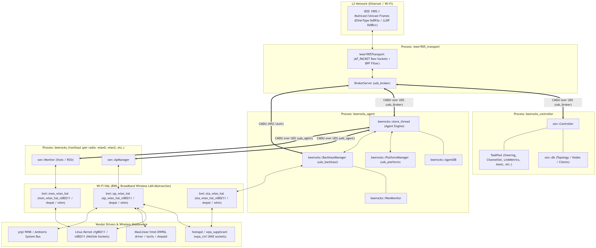
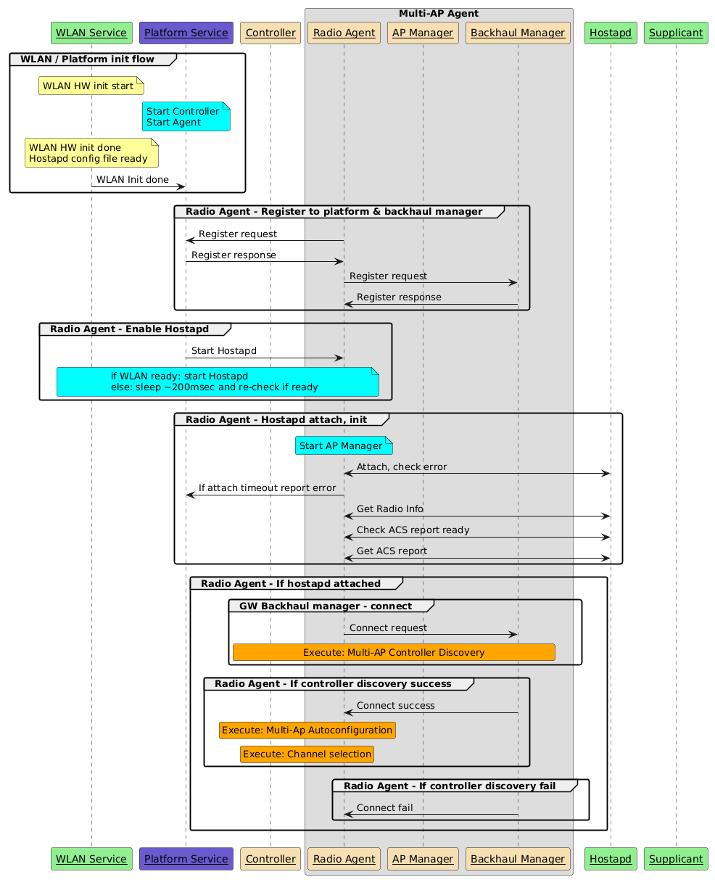

prplMesh is an open-source, carrier-grade, certifiable implementation of the **Wi-Fi Alliance (WFA) EasyMesh™ (Multi-AP)** standard, built on **IEEE 1905.1**. This post walks through the system's architecture end to end — from the EasyMesh standard's high-level features, through the layered BeeRocks component stack and its inter-process communication, to a practical guide for building, running, and operating prplMesh.

### System Architecture Partitioning


### WFA EasyMesh High-Level Features

EasyMesh defines a common set of capabilities that every conformant multi-AP implementation must provide:

- **On-boarding**: A new "multi-AP" device entering the home gains Layer 2 connectivity.
- **Discovery**: A new "multi-AP" device establishes its role as **Controller** or **Agent** (Controlee).
- **Configuration**: A new "multi-AP" device receives the configuration for the home, e.g., SSID naming.
- **Channel selection**: Coordinated channel selection to minimize co-channel interference.
- **Capability reporting**: Understanding the capabilities of every other access point in the ecosystem.
- **Link metric reporting**: Quantifying link quality between access points.
- **Client steering**: Positioning clients on the most advantageous access point/band.
- **Backhaul optimization**: Providing robust inter-access-point links.
- **Higher-layer data payload**: An extensible transport for higher-layer data, enabling vendor- and application-specific extensions on top of the core protocol.

### prplMesh Architecture Analysis

Below is a detailed analysis of the architecture, traversing the complete pipeline:
$$\text{IEEE 1905} \longrightarrow \text{Controller} \longrightarrow \text{Agent} \longrightarrow \text{Backhaul Manager} \longrightarrow \text{AP Manager} \longrightarrow \text{Wi-Fi HAL} \longrightarrow \text{Vendor Driver}$$

---

#### High-Level Architecture Diagram



---

### BeeRocks Architecture

<div style="text-align: justify; text-indent: 2em;">
BeeRocks is designed to run on any Linux-based networking device. The design accounts for the platform/hardware
abstraction needed so that platform-porting effort is limited to a minimal number of affected components. As
described in the high-level architecture above, BeeRocks is divided into controller and agent components, where
the agent runs on every network node and the controller runs on only one device — the gateway (GW) or an
Intelligent Range Extender (IRE) operating in master mode.
</div>

<div style="text-align: justify; text-indent: 2em;">
BeeRocks' internal IPC uses Unix Domain Sockets (UDS), chosen for their portability and efficiency. BeeRocks
provides a communication thread base class that wraps UDS communication in a reusable component. External
communication with the EasyMesh framework is handled over the framework's local bus.
</div>

#### Layer-by-Layer Architecture & Components

##### Layer 1: IEEE 1905 Transport & TLVF Layer
* **Role**: Handles Layer 2 transport for IEEE 1905.1 Control Message Data Units (CMDUs). It isolates all networking protocol encoding/decoding and packet forwarding from the controller and agent business logic.
* **Important Directories**:
  * [`framework/transport/ieee1905_transport/`](prplMesh-6.0.0/framework/transport/ieee1905_transport) — Daemon implementation.
  * [`framework/tlvf/`](prplMesh-6.0.0/framework/tlvf) — TLV (Type-Length-Value) Serialization/Deserialization engine.
  * [`framework/transport/include/mapf/transport/`](prplMesh-6.0.0/framework/transport/include/mapf/transport) — Transport messaging definitions.
* **Process**: `ieee1905_transport`
* **Main Classes**:
  * [`beerocks::transport::Ieee1905Transport`](prplMesh-6.0.0/framework/transport/ieee1905_transport/ieee1905_transport.h#L62): Manages `AF_PACKET` raw sockets on network bridges and Wi-Fi/Ethernet interfaces. Applies BPF (Berkeley Packet Filter) rules to capture EtherType `0x893a` (IEEE 1905.1) and `0x88cc` (LLDP). Handles packet fragmentation, duplicate detection, and relayed multicasting.
  * [`beerocks::transport::broker::BrokerServer`](prplMesh-6.0.0/framework/transport/ieee1905_transport/ieee1905_transport_broker.h#L34): Internal pub/sub message broker. Local processes connect via Unix Domain Sockets and register subscriptions for specific CMDU message types.
  * [`ieee1905_1::CmduMessageRx`](prplMesh-6.0.0/framework/tlvf/src/include/tlvf/CmduMessageRx.h) / [`ieee1905_1::CmduMessageTx`](prplMesh-6.0.0/framework/tlvf/src/include/tlvf/CmduMessageTx.h): TLVF auto-generated classes for parsing and building standard 1905 / Multi-AP messages and TLVs.

---

##### Layer 2: Multi-AP Controller
* **Role**: Central coordinator and decision-maker of the mesh network. Maintains global network topology, radio metrics, and client association states. Implements optimization policies such as client steering (BTM), dynamic channel selection, link metrics querying, and AP auto-configuration.
* **Important Directories**:
  * [`controller/src/beerocks/master/`](prplMesh-6.0.0/controller/src/beerocks/master) — Main controller logic (historically called "master").
  * [`controller/src/beerocks/master/tasks/`](prplMesh-6.0.0/controller/src/beerocks/master/tasks) — Finite state machine tasks.
  * [`controller/src/beerocks/master/db/`](prplMesh-6.0.0/controller/src/beerocks/master/db) — Network data model and station database.
  * [`controller/nbapi/`](prplMesh-6.0.0/controller/nbapi) — Northbound API (Ambiorix / ODL datamodels for TR-181).
* **Process**: `beerocks_controller`
* **Main Classes**:
  * [`son::Controller`](prplMesh-6.0.0/controller/src/beerocks/master/controller.h#L46): Main controller engine. Connects to `uds_broker` via `BrokerClient`, receives/dispatches CMDUs (`handle_cmdu_1905_1_message`), processes association notifications, and launches tasks.
  * [`son::db`](prplMesh-6.0.0/controller/src/beerocks/master/db/db.h): In-memory database of all mesh nodes, AP radios, BSSIDs, clients, capabilities, and link stats.
  * Tasks ([`TaskPool`](prplMesh-6.0.0/controller/src/beerocks/master/tasks/task_pool.h)):
    * [`ClientSteeringTask`](prplMesh-6.0.0/controller/src/beerocks/master/tasks/client_steering_task.h) & [`BtmRequestTask`](prplMesh-6.0.0/controller/src/beerocks/master/tasks/btm_request_task.h): Directs 802.11v BSS Transition Management client steering.
    * [`OptimalPathTask`](prplMesh-6.0.0/controller/src/beerocks/master/tasks/optimal_path_task.h): Computes the best AP/band path based on RSSI and PHY rate.
    * [`ChannelSelectionTask`](prplMesh-6.0.0/controller/src/beerocks/master/tasks/channel_selection_task.h): Radio channel planning and DFS clear handling.
    * [`LinkMetricsTask`](prplMesh-6.0.0/controller/src/beerocks/master/tasks/link_metrics_task.h): Periodically queries 1905 link metrics across agents.

---

##### Layer 3: Multi-AP Agent
* **Role**: Runs on every mesh node (gateway and extenders/IREs). Manages the local node's radios, backhaul connection, and local fronthaul APs. Serves as the gateway between the 1905 transport broker and local radio processes.
* **Important Directories**:
  * [`agent/src/beerocks/slave/`](prplMesh-6.0.0/agent/src/beerocks/slave) — Core agent engine (`beerocks_agent_main.cpp`, `son_slave_thread.cpp`).
  * [`agent/src/beerocks/slave/platform_manager/`](prplMesh-6.0.0/agent/src/beerocks/slave/platform_manager) — Platform manager interface.
  * [`agent/src/beerocks/slave/tasks/`](prplMesh-6.0.0/agent/src/beerocks/slave/tasks) — Agent-side tasks (e.g., `ap_autoconfiguration_task.cpp`, `agent_channel_scan_task.cpp`).
* **Process**: `beerocks_agent`
* **Main Classes**:
  * [`beerocks::slave_thread`](prplMesh-6.0.0/agent/src/beerocks/slave/son_slave_thread.h#L42): Event-loop worker thread. Connects to `uds_broker` for 1905 messages and hosts the `uds_agent` server for AP managers. Translates controller 1905 CMDUs into internal CMDU actions for AP managers.
  * [`beerocks::AgentDB`](prplMesh-6.0.0/agent/src/beerocks/slave/agent_db.h): Local database storing configured radios, active VAPs, backhaul status, and connected clients.
  * [`beerocks::PlatformManager`](prplMesh-6.0.0/agent/src/beerocks/slave/platform_manager/platform_manager.h): Hosts `uds_platform` and queries platform settings (board configuration, operating system, serial numbers) via the **BPL (Beerocks Platform Library)**.

---

##### Layer 4: Backhaul Manager
* **Role**: Manages the agent's uplink connectivity (wired Ethernet vs. wireless backhaul station — bSTA). Handles dynamic backhaul selection, WSC onboarding (M1/M2/M8 exchange), backhaul roaming, and failover.
* **Important Directories**:
  * [`agent/src/beerocks/slave/backhaul_manager/`](prplMesh-6.0.0/agent/src/beerocks/slave/backhaul_manager) — Backhaul manager and WAN monitor implementations.
* **Thread/Process**: Instantiated inside `beerocks_agent` as a dedicated [`EventLoopThread`](prplMesh-6.0.0/common/beerocks/bcl/include/bcl/beerocks_eventloop_thread.h).
* **Main Classes**:
  * [`beerocks::BackhaulManager`](prplMesh-6.0.0/agent/src/beerocks/slave/backhaul_manager/backhaul_manager.h#L48): Coordinates onboarding state machines, bSTA scanning, connection establishment, WPS PBC triggering, and 4-address WDS link creation.
  * [`beerocks::WanMonitor`](prplMesh-6.0.0/agent/src/beerocks/slave/backhaul_manager/wan_monitor.h): Monitors wired Ethernet carrier states (link up/down) to determine whether wired backhaul is available.
  * Utilizes [`bwl::sta_wlan_hal`](prplMesh-6.0.0/common/beerocks/bwl/include/bwl/sta_wlan_hal.h) to control the wireless backhaul station interface.

---

##### Layer 5: AP Manager (& Monitor)
* **Role**: Manages individual Wi-Fi radio chips and their virtual APs (VAPs/BSSs). Executes channel changes, configures BSS parameters, applies MAC ACLs for client steering/blacklisting, sends BTM steering requests, and monitors radio/station metrics.
* **Important Directories**:
  * [`agent/src/beerocks/fronthaul_manager/ap_manager/`](prplMesh-6.0.0/agent/src/beerocks/fronthaul_manager/ap_manager) — AP configuration & event management.
  * [`agent/src/beerocks/fronthaul_manager/monitor/`](prplMesh-6.0.0/agent/src/beerocks/fronthaul_manager/monitor) — Client RSSI monitoring & channel load collection.
  * [`agent/src/beerocks/fronthaul_manager/`](prplMesh-6.0.0/agent/src/beerocks/fronthaul_manager) — Entry point (`fronthaul_manager_main.cpp`).
* **Process**: `beerocks_fronthaul -i <radio_interface>` (one instance per physical Wi-Fi radio, e.g., `wlan0`, `wlan2`).
* **Main Classes**:
  * [`son::ApManager`](prplMesh-6.0.0/agent/src/beerocks/fronthaul_manager/ap_manager/ap_manager.h#L26): Connects to `beerocks_agent` over `uds_agent`. Interfaces with [`bwl::ap_wlan_hal`](prplMesh-6.0.0/common/beerocks/bwl/include/bwl/ap_wlan_hal.h) to enforce channel switches (CSA), add/remove VAPs, send 802.11v BTM requests, and propagate station association/disassociation events.
  * [`son::Monitor`](prplMesh-6.0.0/agent/src/beerocks/fronthaul_manager/monitor/monitor.h): Interfaces with [`bwl::mon_wlan_hal`](prplMesh-6.0.0/common/beerocks/bwl/include/bwl/mon_wlan_hal.h) to poll radio channel utilization and collect client RSSI/traffic stats.

---

##### Layer 6: Wi-Fi HAL (`bwl` - Broadband Wireless LAN)
* **Role**: Hardware abstraction layer that provides a uniform C++ interface for radio configuration, monitoring, and STA operations, shielding upper layers from driver/vendor specifics.
* **Important Directories**:
  * [`common/beerocks/bwl/include/bwl/`](prplMesh-6.0.0/common/beerocks/bwl/include/bwl) — Abstract interfaces.
  * [`common/beerocks/bwl/nl80211/`](prplMesh-6.0.0/common/beerocks/bwl/nl80211) — Generic Linux nl80211 & wpa_ctrl implementation.
  * [`common/beerocks/bwl/dwpal/`](prplMesh-6.0.0/common/beerocks/bwl/dwpal) & [`dwpald/`](prplMesh-6.0.0/common/beerocks/bwl/dwpald) — Intel / MaxLinear DWPAL platform implementation.
  * [`common/beerocks/bwl/whm/`](prplMesh-6.0.0/common/beerocks/bwl/whm) — prpl Wireless Hardware Manager (Ambiorix bus) implementation.
  * [`common/beerocks/bwl/dummy/`](prplMesh-6.0.0/common/beerocks/bwl/dummy) — Stub/mock HAL for testing and simulation.
* **Main Classes**:
  * Abstract base interfaces:
    * [`bwl::base_wlan_hal`](prplMesh-6.0.0/common/beerocks/bwl/include/bwl/base_wlan_hal.h#L34): Base class defining attach/detach, event polling (`process_ext_events`, `process_nl_events`), and event dispatching (`hal_event_cb_t`).
    * [`bwl::ap_wlan_hal`](prplMesh-6.0.0/common/beerocks/bwl/include/bwl/ap_wlan_hal.h#L27): AP operations (`set_channel`, `sta_allow`/`sta_deny`, `sta_disassoc`, `send_btm_req`).
    * [`bwl::mon_wlan_hal`](prplMesh-6.0.0/common/beerocks/bwl/include/bwl/mon_wlan_hal.h): Station and radio statistics polling.
    * [`bwl::sta_wlan_hal`](prplMesh-6.0.0/common/beerocks/bwl/include/bwl/sta_wlan_hal.h): Station/bSTA connection, scanning, and WPS functions.
  * Concrete implementations (e.g., for `nl80211`):
    * [`bwl::nl80211::ap_wlan_hal_nl80211`](prplMesh-6.0.0/common/beerocks/bwl/nl80211/ap_wlan_hal_nl80211.h)
    * [`bwl::nl80211::wpa_ctrl_client`](prplMesh-6.0.0/common/beerocks/bwl/nl80211/wpa_ctrl_client.h)

---

##### Layer 7: Vendor Driver & Wireless Subsystem
* **Role**: Kernel drivers, firmware, and user-space wireless daemons that manage the physical Wi-Fi hardware.
* **Interfaces & Protocols**:
  * **`hostapd` / `wpa_supplicant` Control Interface (`wpa_ctrl`)**: Communicates over UNIX domain sockets (`/var/run/hostapd/<iface>`) for AP management, WPS triggering, and 802.11v BSS Transition Management frames.
  * **Linux `nl80211` / `cfg80211`**: Communicates via netlink generic sockets (`NETLINK_GENERIC` via `libnl-3` and `libnl-genl-3`) directly to the kernel for channel survey info, radio capabilities, and station dump stats.
  * **Vendor HAL APIs (e.g., DWPAL / `libdwpal.so`)**: Direct library and ioctl calls into vendor wireless drivers (such as Intel WAVE / MaxLinear Wi-Fi chipsets).
  * **prpl WHM (Wireless Hardware Manager)**: Ambiorix RPCs over ubus/PCB to interact with platform Wi-Fi services in OpenWrt / prplOS.

---

### Multi-AP Deployment Modes

<div style="text-align: justify; text-indent: 2em;">
To support flexible deployments that meet different customer needs, the Multi-AP stack defines four deployment
modes:
</div>

#### EasyMesh Managed Mode

<div style="text-align: justify; text-indent: 2em;">
This is the full Multi-AP mode, where the framework — 1905.1 plus the BeeRocks agent and controller — is
fully deployed. Communication between components is carried over the XSub/XPub local bus.
</div>


#### EasyMesh Unmanaged Mode
<div style="text-align: justify; text-indent: 2em;">
This mode is identical to EasyMesh Managed Mode except that the controller is not deployed. It assumes an
external controller is attached to the local bus, or is otherwise external to the stack.
</div>


#### Non-Mesh Managed Mode
<div style="text-align: justify; text-indent: 2em;">
This mode allows a non-mesh deployment in which the 1905.1 components are not deployed. The BeeRocks
controller manages the gateway's local radios according to enabled features. In cases where an upper-layer
controller operates alongside the BeeRocks controller, the enabled features of each must not create contention.
</div>


#### Non-Mesh Unmanaged Mode
<div style="text-align: justify; text-indent: 2em;">
This mode is identical to Non-Mesh Managed Mode except that the controller is not deployed. It allows an
external entity to configure the agent and to receive statistics and events from the agent.
</div>


### BeeRocks Inter/Outer Communication (IPC)
<div style="text-align: justify; text-indent: 2em;">
The figure below shows all internal module IPC communication of the Multi-AP stack and BeeRocks when
EasyMesh mode is deployed:
</div>


<div style="text-align: justify; text-indent: 2em;">
For the Non-Mesh mode, where the local bus and 1905.1 are not deployed, communication is carried over
point-to-point UDS connections, carrying the same vendor-specific CMDUs:
</div>


#### IPC Mechanisms & Sockets Summary

prplMesh utilizes distinct IPC mechanisms suited to each communication boundary:

| IPC Type | Socket / Interface Identifier | Endpoints | Purpose |
| :--- | :--- | :--- | :--- |
| **Unix Domain Socket (UDS)** | `/tmp/beerocks/uds_broker` | `ieee1905_transport` $\leftrightarrow$ Controller, Agent, Backhaul Manager, Vendor Message | Pub/Sub message broker for dispatching IEEE 1905.1 CMDUs |
| **Unix Domain Socket (UDS)** | `/tmp/beerocks/uds_agent` | `beerocks_agent` $\leftrightarrow$ `beerocks_fronthaul` (AP Manager / Monitor) | Internal CMDU commands for VAP control, steering, and events |
| **Unix Domain Socket (UDS)** | `/tmp/beerocks/uds_platform` | `PlatformManager` $\leftrightarrow$ Agent, Backhaul Manager, BML | Platform queries (serial numbers, interfaces, modes) |
| **Unix Domain Socket (UDS)** | `/tmp/beerocks/uds_backhaul` | `BackhaulManager` $\leftrightarrow$ Agent | Backhaul status and coordination |
| **Unix Domain Socket (UDS)** | `/tmp/beerocks/uds_controller`| `beerocks_controller` $\leftrightarrow$ `beerocks_cli` / BML | Controller CLI and management RPCs |
| **Raw Sockets (`AF_PACKET`)**| `SOCK_RAW` on interfaces/bridges | `ieee1905_transport` $\leftrightarrow$ Physical Network | IEEE 1905.1 (`0x893a`) & LLDP (`0x88cc`) packet capture/injection with BPF |
| **UNIX Datagram Sockets** | `wpa_ctrl` sockets | `ap_wlan_hal_nl80211` / `sta_wlan_hal_nl80211` $\leftrightarrow$ `hostapd` / `wpa_supplicant` | Hostapd command requests and unsolicited event listener |
| **Netlink Sockets (`AF_NETLINK`)** | `NETLINK_GENERIC` (`nl80211`)| `base_wlan_hal_nl80211` / `nl80211_client` $\leftrightarrow$ Linux Kernel `cfg80211` | Channel surveys, station bitrate dump, interface config |
| **System Bus / IPC** | Ambiorix (`amxb` / ubus / PCB)| Controller / Agent $\leftrightarrow$ TR-181 Data Model / WHM | Northbound API management and platform abstraction |

### BeeRocks Controller
<div style="text-align: justify; text-indent: 2em;">
The BeeRocks controller retains its current architecture with respect to module and task structure, and
introduces a new transport library (BTL) that lets the controller communicate with the local 1905.1 transport
agent over the local message bus. This library integrates with the existing controller message router module.
The transport library is shared by the controller and agent, providing abstraction from the platform-specific
implementation.
</div>


### Controller Database Structure


### BeeRocks Agent

<div style="text-align: justify; text-indent: 2em;">
Similar to the BeeRocks controller, the agent integrates the new BeeRocks Transport Library (BTL), which
enables communication with the platform's 1905.1 stack or an alternative transport service. All agent-specific
APIs are moved to a new library named the BeeRocks Agent Library (BAL). This allows the agent to be
independent of the controller, aligning with the requirement for separate packaging of controller and agent.
</div>


### BeeRocks Flows

#### GW Boot

<div style="text-align: justify; text-indent: 2em;">
The following high-level flow diagram describes the GW boot flow, including the interaction between the
different entities in the system.
</div>



---

### End-to-End Control & Communication Flows

##### Flow A: Client Association & Roaming Decision (Uplink Event Flow)
1. **Vendor Driver → Wi-Fi HAL**: A client associates to an AP. `hostapd` emits an association event over `wpa_ctrl`.
2. **Wi-Fi HAL → AP Manager**: [`bwl::ap_wlan_hal_nl80211`](prplMesh-6.0.0/common/beerocks/bwl/nl80211/ap_wlan_hal_nl80211.cpp) parses the event and invokes [`ApManager::hal_event_handler`](prplMesh-6.0.0/agent/src/beerocks/fronthaul_manager/ap_manager/ap_manager.cpp#L158) with `Event::STA_Connected`.
3. **AP Manager → Agent**: [`ApManager`](prplMesh-6.0.0/agent/src/beerocks/fronthaul_manager/ap_manager/ap_manager.cpp) packs a `cACTION_APMANAGER_CLIENT_ASSOCIATED_NOTIFICATION` CMDU and sends it over `uds_agent` to `beerocks_agent`.
4. **Agent → Transport Broker**: [`beerocks::slave_thread`](prplMesh-6.0.0/agent/src/beerocks/slave/son_slave_thread.cpp) constructs a 1905 **Topology Notification** / **Client Association Event** CMDU and sends it over `uds_broker` to `ieee1905_transport`.
5. **Transport → Controller**: `ieee1905_transport` transmits the frame via a raw socket over Ethernet/Wi-Fi to the controller's transport daemon, which routes it over `uds_broker` to [`son::Controller`](prplMesh-6.0.0/controller/src/beerocks/master/controller.cpp).
6. **Controller Execution**: [`son::Controller`](prplMesh-6.0.0/controller/src/beerocks/master/controller.cpp) updates [`son::db`](prplMesh-6.0.0/controller/src/beerocks/master/db/db.h) and triggers [`AssociationHandlingTask`](prplMesh-6.0.0/controller/src/beerocks/master/tasks/association_handling_task.h) / [`OptimalPathTask`](prplMesh-6.0.0/controller/src/beerocks/master/tasks/optimal_path_task.h).

##### Flow B: Client Steering / BTM Request (Downlink Control Flow)
1. **Controller**: [`ClientSteeringTask`](prplMesh-6.0.0/controller/src/beerocks/master/tasks/client_steering_task.h) determines that a station should steer to another BSSID and generates a Multi-AP **Client Steering Request** CMDU.
2. **Controller → Transport → Agent**: The CMDU is delivered via `uds_broker` → raw socket → the target node's `ieee1905_transport` → `uds_broker` → [`beerocks::slave_thread`](prplMesh-6.0.0/agent/src/beerocks/slave/son_slave_thread.cpp).
3. **Agent → AP Manager**: [`slave_thread`](prplMesh-6.0.0/agent/src/beerocks/slave/son_slave_thread.cpp) decodes the CMDU and forwards the BTM request over `uds_agent` to the corresponding [`son::ApManager`](prplMesh-6.0.0/agent/src/beerocks/fronthaul_manager/ap_manager/ap_manager.cpp).
4. **AP Manager → Wi-Fi HAL**: [`ApManager`](prplMesh-6.0.0/agent/src/beerocks/fronthaul_manager/ap_manager/ap_manager.cpp) invokes [`bwl::ap_wlan_hal::send_btm_req()`](prplMesh-6.0.0/common/beerocks/bwl/include/bwl/ap_wlan_hal.h).
5. **Wi-Fi HAL → Vendor Driver**: [`bwl::nl80211::ap_wlan_hal_nl80211`](prplMesh-6.0.0/common/beerocks/bwl/nl80211/ap_wlan_hal_nl80211.cpp) sends a `BSS_TM_REQ` command over the `wpa_ctrl` socket to `hostapd`, which transmits the 802.11v BSS Transition Management request frame over the air to the client station.

### Source Code

<a href="/prplmesh/index.html">prplMesh API Documentation</a>

---

#### Source Tree Key Directories

```
prplMesh-6.0.0/
├── ci/                            # Continuous integration, certification scripts, boardfarm configs
├── common/beerocks/               # Common core infrastructure
│   ├── bcl/                       # Beerocks Common Library (EventLoop, CMDU server/client, sockets, timers)
│   ├── bwl/                       # Broadband Wireless LAN HAL (interfaces, nl80211, dwpal, whm, dummy)
│   └── tlvf/                      # Common TLVF headers and message structures
├── controller/                    # Multi-AP Controller
│   ├── src/beerocks/master/       # Controller core engine (Controller, son::db, tasks)
│   ├── src/beerocks/master/tasks/ # Controller algorithmic FSM tasks (steering, optimal path, etc.)
│   ├── nbapi/                     # Northbound API (Ambiorix data models)
│   └── src/beerocks/cli/          # CLI management interface
├── agent/                         # Multi-AP Agent
│   ├── src/beerocks/slave/        # Agent core engine (slave_thread, AgentDB, tasks)
│   │   ├── backhaul_manager/      # Backhaul selection, onboarding, WAN monitor
│   │   └── platform_manager/      # Platform capabilities manager
│   └── src/beerocks/fronthaul_manager/ # Radio management
│       ├── ap_manager/            # AP Manager (VAP config, steering, channel switches)
│       └── monitor/               # Radio Monitor (stats, RSSI measurements)
├── framework/                     # Base platform framework
│   ├── platform/bpl/              # Beerocks Platform Library (platform abstraction for Linux, UCI, D-Bus)
│   ├── tlvf/                      # TLV serialization/deserialization code generator and runtime
│   └── transport/                 # IEEE 1905.1 transport daemon and broker
└── tools/                         # Helper tools, Docker build scripts, Beerocks analyzer
```

### prplMesh Usage Guide

This guide covers building, running, operating, configuring, and monitoring prplMesh.

---

#### Prerequisites & Environment Setup

On Linux / test environments (e.g., Ubuntu 18.04+):

```bash
# 1. Load required kernel modules
sudo modprobe ebtables
sudo modprobe mac80211_hwsim  # Only if using simulated Wi-Fi radios

# 2. Create the default bridge (used for AL-MAC and local interfaces)
sudo brctl addbr br-lan
sudo ip link set br-lan up
```

---

#### Building prplMesh

##### Option A: Native Build with CMake and Ninja (Recommended)

```bash
# Configure debug build with unit tests enabled
cmake -B ../build -H. -G Ninja \
    -DCMAKE_BUILD_TYPE=Debug \
    -DBUILD_TESTS=ON \
    -DCMAKE_INSTALL_PREFIX=../build/install

# Compile and install to ../build/install
ninja -C ../build install
```

##### Option B: Using `maptools.py` Utility

```bash
cd tools
pip3 install -r requirements.txt

# Build all components
python3 ./maptools.py build

# Clean and rebuild
python3 ./maptools.py build -c clean make
```

##### Option C: Docker Environment

```bash
# Build the Docker builder image and run the build inside the container
./tools/docker-builder.sh
```

---

#### Starting and Stopping prplMesh Services

The script `prplmesh_utils.sh` (located in `build/install/scripts/`, or generated from `common/beerocks/scripts/prplmesh_utils.sh.in`) handles daemon lifecycle management.

```bash
cd <path/to/install/dir>/scripts    # e.g., ../build/install/scripts
```

#### Start prplMesh

```bash
# Start in default mode (Controller + Agent)
sudo ./prplmesh_utils.sh start

# Start in Agent-only mode (e.g., on a Wi-Fi Extender / IRE)
sudo ./prplmesh_utils.sh start -m Multi-AP-Agent

# Start in Controller-only mode
sudo ./prplmesh_utils.sh start -m Multi-AP-Controller

# Start with certification mode enabled (e.g., for a WFA test bed)
sudo ./prplmesh_utils.sh start -c 1
```

#### Check Status & Stop

```bash
# Check status of running processes and mesh topology
sudo ./prplmesh_utils.sh status

# Stop all prplMesh processes
sudo ./prplmesh_utils.sh stop

# Restart
sudo ./prplmesh_utils.sh restart
```

---

#### CLI Tools and Network Management

##### `prplmesh_cli` (Unified CLI Tool)

```bash
# Display general mesh network status in human-readable format
sudo ./build/install/bin/prplmesh_cli -c status -o pretty

# Output mesh status as JSON
sudo ./build/install/bin/prplmesh_cli -c status -o json

# Print connection tree / map
sudo ./build/install/bin/prplmesh_cli -c conn_map

# Configure Wi-Fi SSID for an access point
sudo ./build/install/bin/prplmesh_cli -c set_ssid -o <ap_mac_or_iface> -n "MyMeshSSID"

# Configure Wi-Fi Security
sudo ./build/install/bin/prplmesh_cli -c set_security -o <ap_mac_or_iface> -m "WPA2-Personal" -p "MySecretPassword"
```

##### `beerocks_cli` (Low-Level Management & Diagnostics)

```bash
# Interactive CLI shell
sudo ./build/install/bin/beerocks_cli

# Single command execution: Dump connection map
sudo ./build/install/bin/beerocks_cli -c bml_conn_map

# Ping the controller / backend
sudo ./build/install/bin/beerocks_cli -c bml_ping

# Query full topology
sudo ./build/install/bin/beerocks_cli -c bml_nw_map_query

# Trigger WPS Onboarding on an interface
sudo ./build/install/bin/beerocks_cli -c "bml_wps_onboarding wlan0"
```

---

#### Log Files & Diagnostics

Log files are generated in `/tmp/beerocks/logs/` (and `/tmp/mapf/`):

| Component | Log File Path |
| :--- | :--- |
| **Controller** | `/tmp/beerocks/logs/beerocks_controller.log` |
| **Agent** | `/tmp/beerocks/logs/beerocks_agent.log` |
| **Backhaul / Platform Manager** | `/tmp/beerocks/logs/beerocks_backhaul.log` |
| **Fronthaul AP Manager (`wlan0`)** | `/tmp/beerocks/logs/beerocks_ap_manager_wlan0.log` |
| **Fronthaul Monitor (`wlan0`)** | `/tmp/beerocks/logs/beerocks_monitor_wlan0.log` |
| **Fronthaul AP Manager (`wlan2`)** | `/tmp/beerocks/logs/beerocks_ap_manager_wlan2.log` |
| **1905 Transport Framework** | `/tmp/mapf/` |

> **Operational Check**: The agent is ready when you observe `FSM: CONNECTED --> OPERATIONAL` in `/tmp/beerocks/logs/beerocks_agent.log`.

---

#### Graphical Network Visualizer

prplMesh includes a Python GUI visualizer for the live mesh topology:

```bash
cd tools/beerocks_analyzer
python3 beerocks_analyzer.py
```
*(Refer to `tools/beerocks_analyzer/README.md` for prerequisite GUI packages.)*