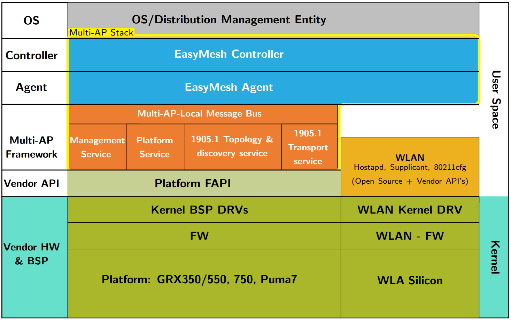
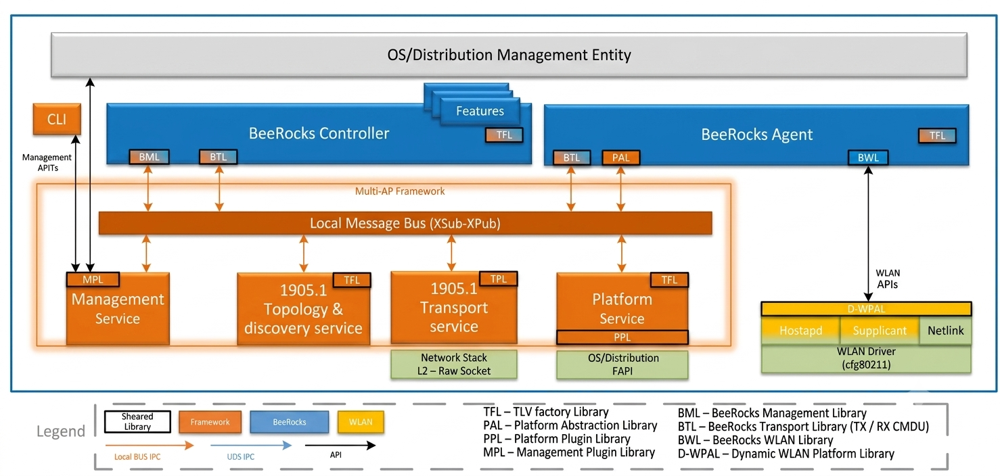
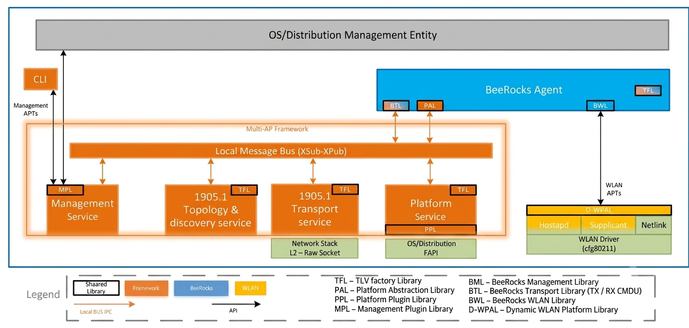
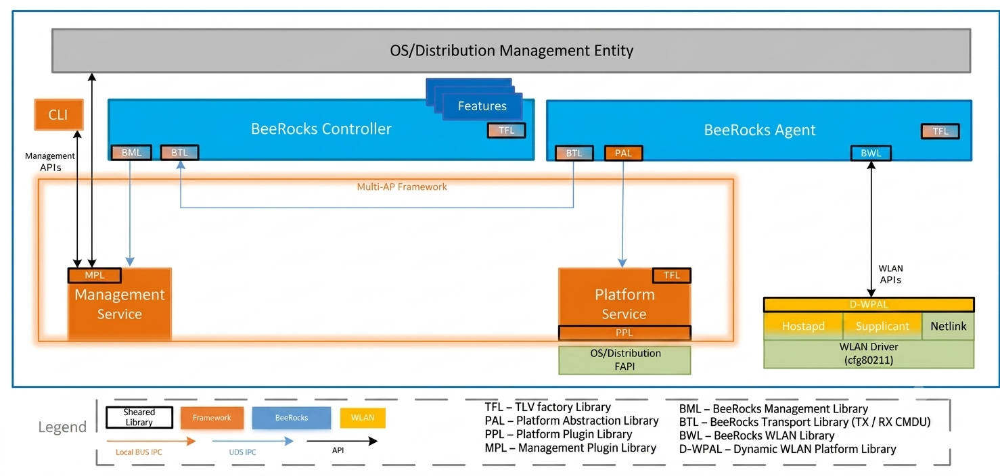
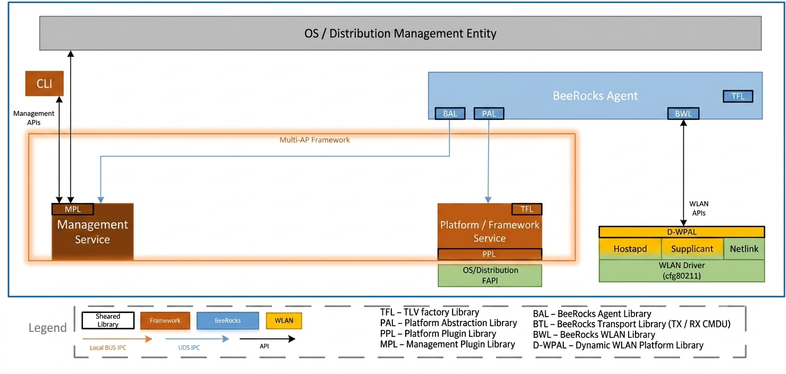
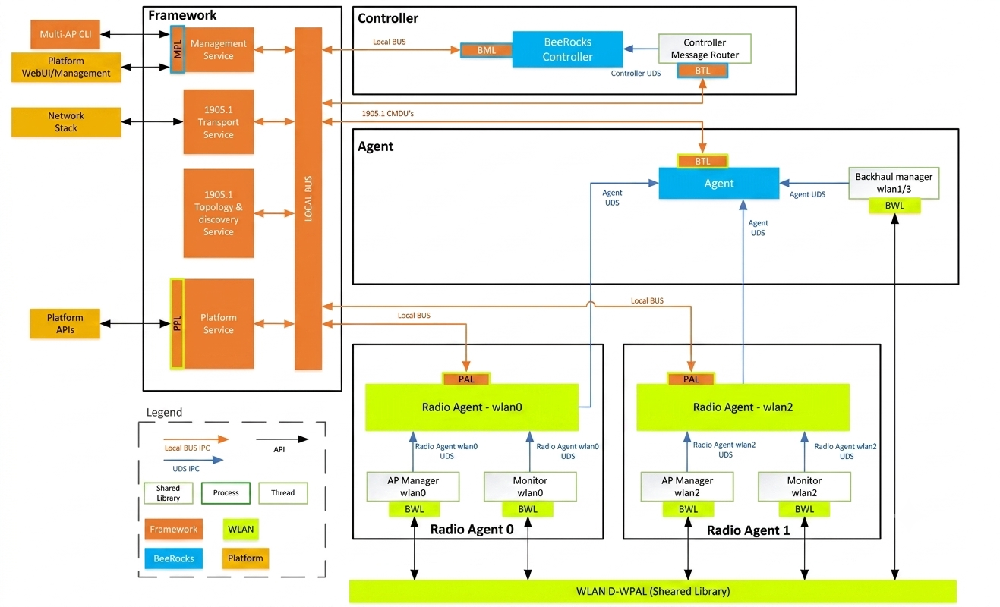
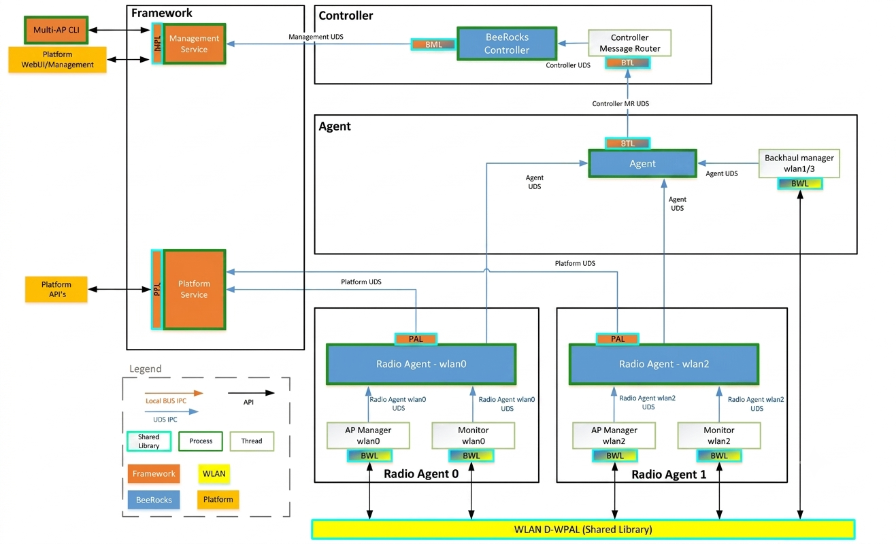
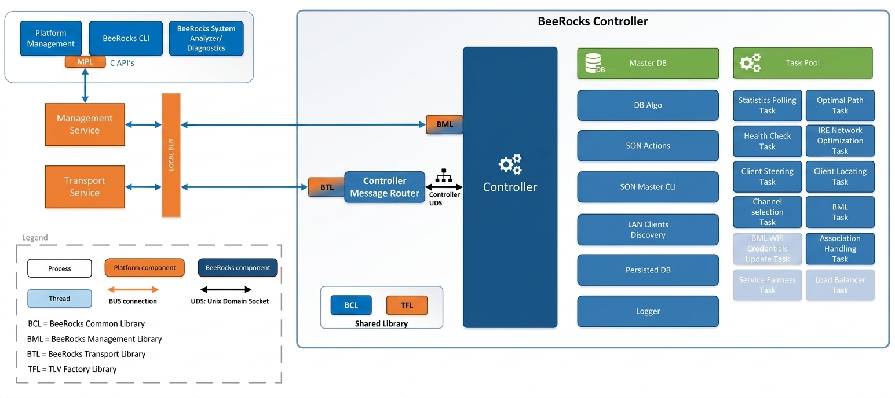
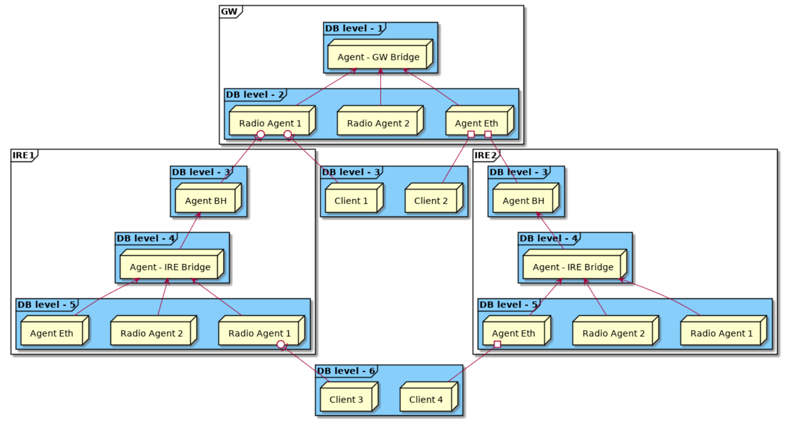
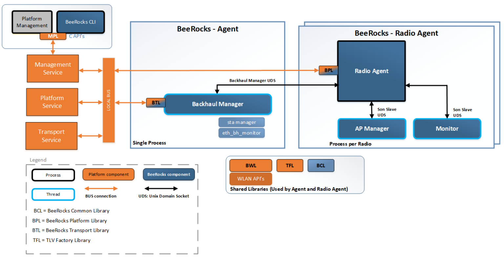

### System Architecture Partitioing

### WFA EasyMesh High Level Feature
- On-boarding: A new ‘multi-AP’ device entering the home gains layer 2 connectivity.
- Discovery: A new ‘multi-AP’ device establishes its role as ‘Controller’ or ‘Agent (Controlee)’.
- Configuration: A new ‘multi-AP’ device is provided with the configuration for the home e.g. SSID naming.
- Channel selection: coordinated channel selection to minimize co-channel interference.
- Capability reporting: understanding the capabilities of all the other access points in the ecosystem.
- Link metric reporting: quantifying the link capability between access points.
- Client steering: to position clients on the most advantageous access point/band.
- Backhaul optimization: providing robust inter access point links.
- Higher layer data payload: to provide extensible.

### BeeRocks Architecture

BeeRocks is designed to run on any Linux based networking device. Design takes in to considerations needed
platform / HW abstraction so that platform porting effort is constrained to minimum number of defected
components. As described in the high level architecture intro, BeeRocks is divided to controller and agent
components where agent runs on all network nodes and controller runs only on one device GW or IRE (AKA
IRE master mode).

BeeRocks internal IPC is done via Unix Domain Sockets (UDS) which are very portable and efficient. BeeRocks
has a communication thread base class that UDS communication with reusable wrapper class. External communication to the EasyMesh framework is done via the framework local BUS.

### Multi-AP Deployment Modes

To allow a flexible deployment of the Multi-AP stack that meets the needs of different customers the stack
defines four deployments mode:

#### EasyMesh Managed Mode

This is the full Multi-AP mode there the framework with 1905.1 + BeeRocks agent + controller is deployed.
Communication between components is made via the XSub/XPub local bus.

#### EasyMesh Unmanaged Mode

This mode is identical to the EasyMesh managed mode except the controller is not deployed. It is assumed that
an external controller is attached to the local bus or compliantly external to the stack.

#### None Mesh Managed Mode

This mode allows non mesh deployment where 1905.1 components are not deployed.
BeeRocks controller manages the GW local radios according to enabled features. There may be a case where
there is an upper layer controller operating alongside the BeeRocks controller, in this case the enabled features
of each must not crate a contention.

#### None Mesh Unmanaged Mode

This mode is identical to the None Mesh Managed mode except the controller is not deployed.
The mode allows external entity to configure agent and receive statistics and events form the agent.

### BeeRocks Inter/Outer Communication (IPC)

The following figure shows all inner module IPC communication of the Multi-AP stack and BeeRocks when the
EasyMesh mode is deployed:

For the Non Mesh mode where the local bus and 1905.1 are not deployed the communication is done using p2p
UDS carring the came vendor specific CMDU's:

### BeeRocks Controller

BeeRocks controller will maintain its current architecture in respect to modules / task structure and will
introduce a new transport library (BTL) that will allow the controller to communicate with the local 1905.1
transport agent via the local message bus. This library will be integrated to existing controller message router
module. The transport library is used by controller and agent and allow abstraction from the platform specific
implementation.

### Controller Database Structure

### BeeRocks Agent

Similar to BeeRocks controller the agent will integrate the new BeeRocks Transport Library (BTL) that will allow
communication with platform 1905.1 or alternative transport service.
All agent specific API's will be moved to new library named BeeRocks Agent Library (BAL). This will allow the
agent to be independent from controller, aligning to the requirement to have separate packaging for controller
and agent.

### BeeRocks Flows

#### GW Boot

The following high level flow diagram describes the GW boot flow inducing interaction between the different
entities in the system.

### Source Code 

<a href="/prplmesh/index.html">prplMesh API Documentation</a>