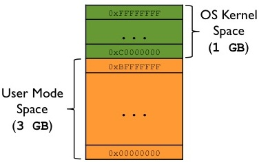

<div style="text-align: justify; text-indent: 2em;">
In this post, I will explain how a program is laid out in main memory for execution.  
We assume a 32-bit x86 architecture running a multitasking Linux OS.  
(Some details may differ on other systems.)
</div>

### Virtual Address Space Overview
Each process runs in its own **memory sandbox** — the **virtual address space**.  
On a 32-bit system, this is a **4GB block** of memory addresses.
- The CPU generates virtual addresses (from `0x00000000` to `0xFFFFFFFF`).
- The OS kernel maps these to physical memory via **page tables**.
- The kernel reserves a dedicated portion of the virtual space for itself.

#### Typical Split on 32-bit Linux

| Region              | Address Range          | Size   |
| ------------------- | ---------------------- | ------ |
| User space (process) | `0x00000000` – `0xBFFFFFFF` | 3 GB   |
| Kernel space        | `0xC0000000` – `0xFFFFFFFF` | 1 GB   |

The following diagram shows this split:



> For more details, see the post on *Virtual Memory, Paging, and Swapping*.

---

### Memory Layout of a Process (User Space)

The diagram below shows how a program (process) looks inside the **user mode portion** of the virtual address space:


Now let's examine each segment in detail.

---

#### Text Segment (Code)

- Contains **executable instructions** of the program.
- Often placed **below the Heap or Stack** to prevent overflows from overwriting it.
- **Sharable** — only one copy needs to be in memory for frequently used programs (e.g., shells, compilers).
- **Read-only / Execute** — prevents accidental modification of instructions.

---

#### Data Segment (Initialized Data)

Stores **global and static variables** that are explicitly initialized by the programmer.

Can be further divided into:

| Sub-area     | Content                                      | Writable? |
| ------------ | -------------------------------------------- | --------- |
| `.rodata`    | Read-only data (e.g., string literals)       | No        |
| `.data`      | Read-write initialized data                  | Yes       |

#### Examples

```c
char s[] = "hello world";   // stored in .data (read-write)
int debug = 1;              // stored in .data (read-write)

const char* str = "hello world";
// "hello world" → .rodata
// str (pointer) → .data (because pointer can be modified)

static int i = 10;          // stored in .data
```

The Data segment is not read-only in general — variable values can change at runtime.

###  BSS Segment (Uninitialized Data)
Stands for "Block Started by Symbol" (an ancient assembler term).

Contains global and static variables that are:

- Initialized to zero, or
- Not explicitly initialized at all.
- The OS kernel zeros out this segment before the program starts.
- Read-Write.

### Heap

- Used for dynamic memory allocation (malloc, new, etc.).
- Begins at the end of the BSS segment.
- Grows upward (toward higher addresses).
- Managed by malloc/free, brk, sbrk.
- Shared by all shared libraries and dynamically loaded modules.

### Stack

- Stores the program stack (LIFO structure).
- Located in higher memory addresses, just below the kernel space.
- On x86, it grows downward (toward lower addresses).
- Contains stack frames — one per function call.

Each stack frame includes:

- Automatic (local) variables
- Function parameters
- Return address (to the caller)

> This is how recursive functions work: each call gets a new, independent stack frame.

A stack pointer register tracks the current top of the stack.
If the stack pointer meets the heap pointer (or hits RLIMIT_STACK), memory is exhausted.

### The Unmapped Zone (0x00000000 – 0x08048000)

A critical but often overlooked part of the layout is the unmapped region from 0x00000000 up to 0x08048000 (128 MB on older 32-bit Linux).

- This area contains no code, no data, no stack, no heap.
- It is deliberately left unmapped by the OS.

#### Why does it exist?

To catch null pointer dereferences.
If a program tries to access memory via a NULL pointer (address 0x0) or a small offset from it, the access falls into this unmapped region, triggering a segmentation fault — immediately crashing the process and preventing silent memory corruption.

Without this guard zone, dereferencing a null pointer could silently corrupt the Text, Data, or BSS segments, leading to unpredictable behavior.

### Notes on Other Architectures

- On 64-bit Linux, the text segment typically starts at 0x00400000, but the unmapped guard zone at address zero remains.
- On some architectures, the stack may grow upward instead of downward.
- The exact split between user/kernel space can vary (e.g., 2 GB / 2 GB, 1 GB / 3 GB).

### Further Reading

- Virtual Memory, Paging, and Swapping
- man proc (see /proc/[pid]/maps)
- execve(2) and brk(2) system calls
- ELF binary format specification

<div style="text-align: justify; text-indent: 2em;">
Many programming languages don’t require you to think about the stack and the heap very often. But in a systems programming language like Rust, whether a value is on the stack or the heap affects how the language behaves and why you have to make certain decisions. Parts of ownership will be described in relation to the stack and the heap later in this chapter, so here is a brief explanation in preparation.
</div>

<div style="text-align: justify; text-indent: 2em;">
Both the stack and the heap are parts of memory available to your code to use at runtime, but they are structured in different ways. The stack stores values in the order it gets them and removes the values in the opposite order. This is referred to as last in, first out. Think of a stack of plates: when you add more plates, you put them on top of the pile, and when you need a plate, you take one off the top. Adding or removing plates from the middle or bottom wouldn’t work as well! Adding data is called pushing onto the stack, and removing data is called popping off the stack. All data stored on the stack must have a known, fixed size. Data with an unknown size at compile time or a size that might change must be stored on the heap instead.
</div>

<div style="text-align: justify; text-indent: 2em;">
The heap is less organized: when you put data on the heap, you request a certain amount of space. The memory allocator finds an empty spot in the heap that is big enough, marks it as being in use, and returns a pointer, which is the address of that location. This process is called allocating on the heap and is sometimes abbreviated as just allocating (pushing values onto the stack is not considered allocating). Because the pointer to the heap is a known, fixed size, you can store the pointer on the stack, but when you want the actual data, you must follow the pointer. Think of being seated at a restaurant. When you enter, you state the number of people in your group, and the host finds an empty table that fits everyone and leads you there. If someone in your group comes late, they can ask where you’ve been seated to find you.
</div>

<div style="text-align: justify; text-indent: 2em;">
Pushing to the stack is faster than allocating on the heap because the allocator never has to search for a place to store new data; that location is always at the top of the stack. Comparatively, allocating space on the heap requires more work because the allocator must first find a big enough space to hold the data and then perform bookkeeping to prepare for the next allocation.
</div>

<div style="text-align: justify; text-indent: 2em;">
Accessing data in the heap is generally slower than accessing data on the stack because you have to follow a pointer to get there. Contemporary processors are faster if they jump around less in memory. Continuing the analogy, consider a server at a restaurant taking orders from many tables. It’s most efficient to get all the orders at one table before moving on to the next table. Taking an order from table A, then an order from table B, then one from A again, and then one from B again would be a much slower process. By the same token, a processor can usually do its job better if it works on data that’s close to other data (as it is on the stack) rather than farther away (as it can be on the heap).
</div>

<div style="text-align: justify; text-indent: 2em;">
When your code calls a function, the values passed into the function (including, potentially, pointers to data on the heap) and the function’s local variables get pushed onto the stack. When the function is over, those values get popped off the stack.
</div>

<div style="text-align: justify; text-indent: 2em;">
Keeping track of what parts of code are using what data on the heap, minimizing the amount of duplicate data on the heap, and cleaning up unused data on the heap so you don’t run out of space are all problems that ownership addresses. Once you understand ownership, you won’t need to think about the stack and the heap very often, but knowing that the main purpose of ownership is to manage heap data can help explain why it works the way it does.
</div>