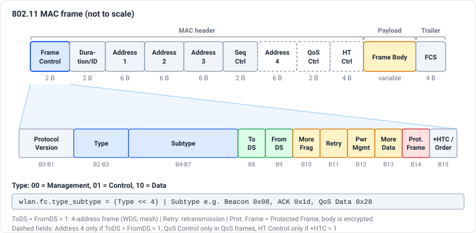
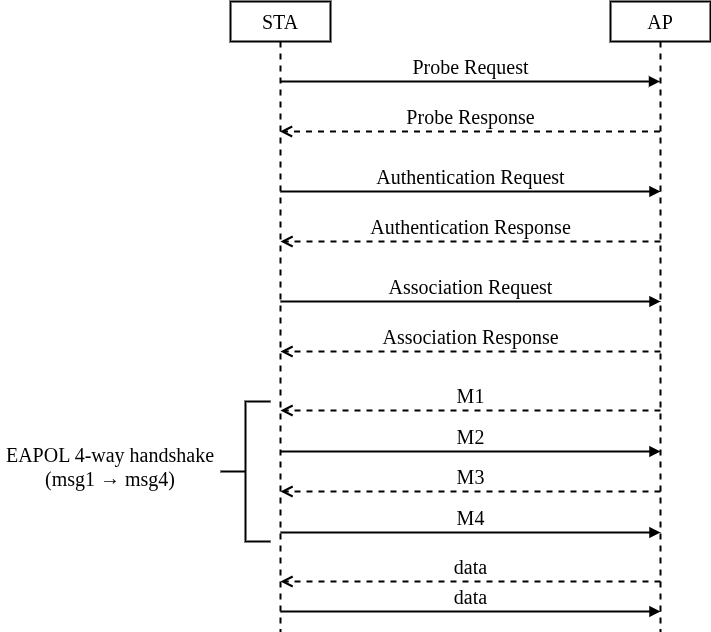
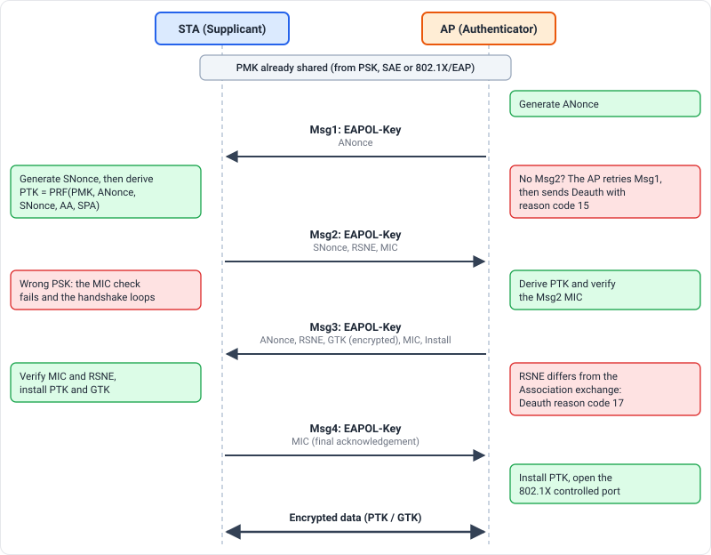
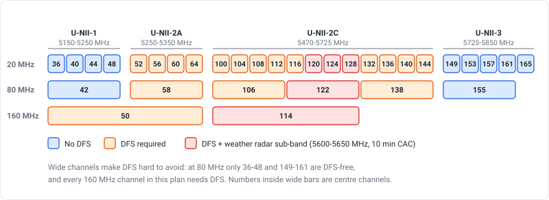
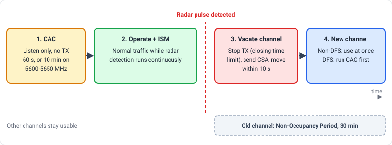
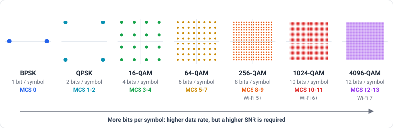
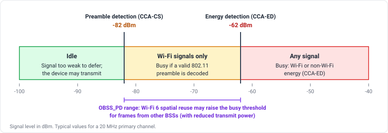
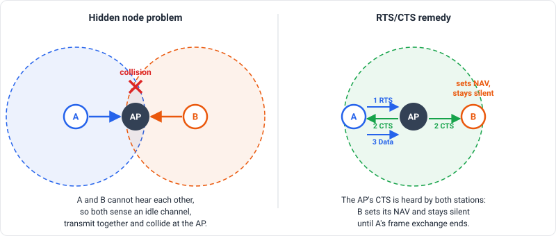

This post is a field reference for Wi-Fi engineers. It walks through the 802.11 frame families, how a station joins a network, what WPA2 and WPA3 actually change, and the three mechanisms that most often explain "the Wi-Fi is slow" tickets: DFS, MCS and CCA.

---

### 802.11 Frame Types

---

| Frame Type | Function                            | Examples                                  |
|------------|-------------------------------------|-------------------------------------------|
| Management | Establish and maintain connections  | Beacon, Probe, Authentication, Action     |
| Control    | Channel access and frame exchange   | ACK, RTS, CTS, Block Ack, Trigger         |
| Data       | Carry user data and power-save state| Data, QoS Data, Null, QoS Null            |

---

#### Management Frames

---

| Message                      | Function |
|------------------------------|----------|
| Beacon                       | Broadcast periodically by the AP: SSID, supported rates, capabilities (HT/VHT/HE/EHT), RSN information, TSF timestamp, beacon interval and TIM/DTIM |
| Probe Request/Response       | Active scanning. The STA asks for a specific or any SSID, and the AP answers with the same information as a Beacon |
| Authentication               | Start of the link-level authentication. Open System is used by WPA2, while WPA3-Personal carries the SAE Commit/Confirm exchange in these frames. Shared Key is legacy WEP only |
| Association Request/Response | Establish the connection after authentication and negotiate capabilities (PHY modes, RSN, PMF, rates) |
| Reassociation                | The STA moves to another AP in the same ESS (roaming) |
| Disassociation               | Tear down the association while the STA stays authenticated |
| Deauthentication             | Tear down authentication, and with it the association and the security context |
| Action                       | Carries advanced features: ADDBA/DELBA (Block Ack setup), BSS Transition Management (BTM), Radio Measurement (Neighbor/Beacon Report), Fast Transition (FT), Channel Switch Announcement (CSA) and SA Query (PMF) |

---

#### Control Frames

---

| Message                    | Function |
|----------------------------|----------|
| ACK                        | Acknowledges a successfully received unicast frame |
| RTS (Request to Send)      | Reserves the medium in advance, which reduces collisions caused by hidden nodes |
| CTS (Clear to Send)        | Answers an RTS and tells other stations to defer (sets their NAV) |
| Block Ack Request/Block Ack| Acknowledges a batch of QoS frames in one response. See [Block Ack](/blog/blockack/) |
| PS-Poll                    | A dozing STA tells the AP it is awake and wants its buffered frames |
| NDP Announcement           | Starts a channel-sounding exchange used for beamforming and MU-MIMO. See [MIMO](/blog/mimo/) |
| Trigger                    | Wi-Fi 6/7 only. The AP schedules uplink OFDMA / UL MU transmissions |

---

#### Data Frames

---

| Message   | Function |
|-----------|----------|
| Data      | Carries the user payload (TCP/IP, etc.) |
| QoS Data  | Data with a TID/priority field for WMM (voice, video, best effort, background) |
| Null Data | No payload. Signals power-save state (the PM bit) or is used as a keep-alive and presence probe |
| QoS Null  | Same as Null Data, but for QoS-capable stations |

Frames with both ToDS and FromDS set use the 4-address format, which is the basis of [WDS](/blog/wds/) and mesh backhaul links.

---

#### MAC Frame Format

---

Every frame starts with a Frame Control field that tells the receiver what kind of frame follows. Its Type and Subtype bits are exactly what Wireshark's `wlan.fc.type_subtype` filter matches on.



---

### Security: WPA/WPA2/WPA3

---

| Message                           | Function |
|-----------------------------------|----------|
| EAPOL-Key frames                  | The four messages (Msg1 to Msg4) of the 4-way handshake. They are carried inside Data frames (EtherType 0x888E), not Management frames |
| SAE Commit/Confirm                | WPA3-Personal. Replaces the PSK-derived PMK with a password-authenticated key exchange (Dragonfly) |
| PMF (Protected Management Frames) | IEEE 802.11w. Protects robust management frames such as Deauthentication and Disassociation from spoofing |

---

#### WPA2 vs WPA3

---

| Characteristic        | WPA2-Personal                                     | WPA3-Personal |
|-----------------------|---------------------------------------------------|---------------|
| PMK source            | Derived from the passphrase and SSID (PBKDF2, 4096 iterations). Identical for every session | SAE produces a fresh PMK for each session |
| Offline attacks       | A captured handshake (or PMKID) can be attacked offline against a dictionary | Every guess needs a live exchange with the AP, so offline dictionary attacks do not work |
| Forward secrecy       | No. A leaked passphrase exposes previously captured traffic | Yes |
| PMF                   | Optional                                          | Mandatory |
| Authentication frames | Open System                                       | SAE Commit/Confirm |
| Handshake             | 4-way EAPOL                                       | SAE, then the same 4-way EAPOL to derive the PTK and GTK |

WPA3 transition mode (WPA2 and WPA3 on the same SSID) keeps older clients working, but it also keeps the WPA2 attack surface alive. See [WPA3](/blog/wpa3/) for the full story.

---

### Wi-Fi Connection

---

The sequence for a typical client joining a protected network:

1. **Scanning:** passive (listen for Beacons) or active (Probe Request/Response).
2. **Authentication:** Open System, or SAE Commit/Confirm for WPA3.
3. **Association:** capabilities, RSN and PMF settings are negotiated.
4. **802.1X/EAP:** only for WPA2/WPA3-Enterprise, to derive the PMK.
5. **4-way handshake:** derives and installs the PTK and the GTK.
6. **Data:** DHCP/ARP, then optional Block Ack setup (ADDBA).



For roaming with the same security context, see [802.11r Fast Roaming](/blog/802_11r_fast_roaming/).

---

### 4-Way Handshake

---

After authentication (and EAP, for Enterprise) both sides share the PMK. The 4-way handshake proves that both sides hold the same PMK without ever sending it, and derives the fresh keys that protect the traffic: the PTK for unicast and the GTK for broadcast and multicast.



The red notes mark where the common failures from the next section show up.

---

### Common Errors in 4-Way Handshake

---

| Error                          | Reason |
|--------------------------------|--------|
| MIC mismatch                   | The PMK differs on the two sides (wrong PSK), or the frame was modified or corrupted |
| Timeout on Msg1                | The STA does not answer: driver bug, weak signal, STA out of range, or the STA does not support the configured security suite |
| Replay Counter mismatch        | The AP and STA disagree on the Replay Counter: software bug, a duplicated frame, or an attack |
| Handshake loop (Msg1 retries)  | The STA keeps returning Msg2 with a bad MIC, so the AP retries Msg1 until it gives up |
| Msg3 rejected                  | The RSNE in Msg3 differs from the one in the (Re)Association exchange. The STA treats it as a downgrade attempt and disconnects |

Most of these end with a Deauthentication carrying reason code 15 (4-way handshake timeout). Reason code 17 points specifically at an RSNE mismatch.

To read the handshake in Wireshark, capture it in full (from the Probe or Association exchange through Msg4), then add the PSK under Edit > Preferences > Protocols > IEEE 802.11 > Decryption keys.

---

### Wireshark Message

---

<a href="../../assets/documents/wifi/6ec7dbaf0411.pcapng" target="_blank">802.11 Messages with Wireshark</a><br>

Useful display filters for the capture above:

| Purpose                              | Filter |
|--------------------------------------|--------|
| Beacons                              | `wlan.fc.type_subtype == 0x08` |
| Probe Request/Response               | `wlan.fc.type_subtype in {0x04 0x05}` |
| Authentication and (Re)Association   | `wlan.fc.type_subtype in {0x0b 0x00 0x01 0x02 0x03}` |
| Disassociation and Deauthentication  | `wlan.fc.type_subtype in {0x0a 0x0c}` |
| Action frames (BTM, ADDBA, CSA...)   | `wlan.fc.type_subtype == 0x0d` |
| Block Ack Request/Block Ack          | `wlan.fc.type_subtype in {0x18 0x19}` |
| 4-way handshake                      | `eapol` |
| Retransmissions                      | `wlan.fc.retry == 1` |
| Handshake timeout disconnects        | `wlan.fixed.reason_code == 15` |

---

### Dynamic Frequency Selection (DFS)

---

DFS is a requirement for 5 GHz Wi-Fi to share spectrum with radar systems (weather, military and satellite). It was introduced in IEEE 802.11h in 2003. The rule is simple: before using a radar-protected channel the AP must prove the channel is free, and while using it the AP must leave immediately if radar appears.

#### DFS Channels

---

| Band     | Channels (20 MHz)     | DFS |
|----------|-----------------------|-----|
| U-NII-1  | 36 to 48              | No |
| U-NII-2A | 52 to 64 (5250-5350 MHz)   | Yes |
| U-NII-2C | 100 to 144 (5470-5725 MHz) | Yes. Channels 120 to 128 (5600-5650 MHz) overlap weather radar and need a longer CAC |
| U-NII-3  | 149 to 165            | No |



Wider channels make DFS hard to avoid: at 80 MHz only 36-48 and 149-161 are DFS-free, and every 160 MHz channel in this plan needs DFS.

The 2.4 GHz and 6 GHz bands do not use DFS. Exact channel availability differs by regulatory domain, so always check the local rules.

---

#### Radar Detection Mechanism

---

1. **Channel Availability Check (CAC):** before transmitting, the AP listens on the target channel. A typical CAC is 60 seconds, and 10 minutes on the 5600-5650 MHz weather radar sub-band.
2. **In-Service Monitoring (ISM):** while operating, the AP keeps looking for radar pulses.
3. **Radar detected:** the AP stops transmitting, announces the move to its clients with a Channel Switch Announcement (CSA) in Beacons and Action frames, and switches channel.
4. **Non-Occupancy Period (NOP):** the vacated channel cannot be used again for 30 minutes.



| Parameter                         | Typical value                      |
|-----------------------------------|------------------------------------|
| Channel Availability Check        | 60 s (10 min on 5600-5650 MHz)     |
| Channel Move Time                 | 10 s                               |
| Channel Closing Transmission Time | 260 ms (FCC) / 1 s (ETSI)          |
| Non-Occupancy Period              | 30 min                             |

The timers and radar pulse patterns are defined per region (for example FCC KDB 905462 and ETSI EN 301 893), so treat the values above as a guide rather than a compliance reference.

---

#### Weather Radar Interference

---

Before Wi-Fi arrived, one of the main users of the 5 GHz band was Terminal Doppler Weather Radar (TDWR). Early Wi-Fi deployments caused real interference with weather radar in several countries, which is why regulators tightened DFS conformance testing and singled out the 5600-5650 MHz range with its longer CAC.

---

#### DFS in Practice

---

- **Clients scan DFS channels passively.** A STA cannot send Probe Requests on a DFS channel until it hears a Beacon, so discovery and roaming onto a DFS channel are slower.
- **A channel move is disruptive.** If the new channel is also a DFS channel and has not been pre-cleared, the CAC adds up to a minute (or ten) of downtime. Some APs use a second radio for background CAC ("zero-wait DFS") to avoid this.
- **False radar detections happen.** They are usually caused by other 5 GHz transmitters or poor RF design, and they show up as unexplained channel changes in the AP log.
- **Mesh backhaul on DFS is fragile.** A radar event takes the backhaul down for every node behind it. See [PrplMesh Architecture](/blog/prplmesh/).

---

### Modulation and Coding Scheme (MCS)

---

A Modulation and Coding Scheme (MCS) is an index that defines how a frame is transmitted: the **modulation** (bits per subcarrier) and the **coding rate** (how much of the transmitted data is useful rather than error-correction overhead). A higher MCS gives a higher data rate but needs a better signal-to-noise ratio. Rate adaptation constantly chooses the highest MCS the channel can support.



Each step packs more points into the same signal space, so less noise is enough to push one point onto its neighbour. That is why the top MCS values need a clean, strong signal. The MCS numbers in the figure follow the HE/EHT table.

For Wi-Fi 6 (HE) the MCS table is:

| MCS | Modulation | Coding rate |
|-----|-----------|-------------|
| 0   | BPSK      | 1/2 |
| 1   | QPSK      | 1/2 |
| 2   | QPSK      | 3/4 |
| 3   | 16-QAM    | 1/2 |
| 4   | 16-QAM    | 3/4 |
| 5   | 64-QAM    | 2/3 |
| 6   | 64-QAM    | 3/4 |
| 7   | 64-QAM    | 5/6 |
| 8   | 256-QAM   | 3/4 |
| 9   | 256-QAM   | 5/6 |
| 10  | 1024-QAM  | 3/4 |
| 11  | 1024-QAM  | 5/6 |

Wi-Fi 7 (EHT) adds MCS 12 and 13 with 4096-QAM at rates 3/4 and 5/6. See [Wi-Fi 7](/blog/wifi7/).

The PHY rate follows from the table and the channel parameters:

```
Rate = (N_SD x N_BPSCS x R x N_SS) / T_SYM
```

N_SD is the number of data subcarriers, N_BPSCS the bits per subcarrier, R the coding rate, N_SS the number of spatial streams and T_SYM the symbol duration (for HE: 12.8 us plus the guard interval).

Example: HE, 80 MHz (980 data subcarriers), MCS 11, 2 spatial streams, 0.8 us guard interval:

```
Rate = (980 x 10 x 5/6 x 2) / 13.6 us = ~1201 Mbps
```

Two things to keep in mind when reading MCS values:

- In HT, the MCS index also encodes the number of streams (0 to 7 for one stream, 8 to 15 for two). In VHT, HE and EHT the index and the stream count are separate.
- The receiver sensitivity requirement drops steeply as MCS rises: roughly -82 dBm for MCS 0 versus about -50 dBm for MCS 11 on a 20 MHz channel. The top MCS values are only reachable close to the AP.

<a href="https://mcsindex.net/" target="_blank">MCS Table (HT/VHT/HE) - MCSINDEX.NET</a><br>

---

### Clear Channel Assessment (CCA)

---

Clear Channel Assessment (CCA) is the mechanism a Wi-Fi device uses to decide whether the medium is idle or busy before it transmits. It is the physical carrier-sense part of CSMA/CA, and it works together with the NAV (virtual carrier sense), which is set from the Duration field of overheard frames.

CCA operates in two modes:

---

#### Energy Detection (ED)

---

- Measures the total energy on the channel, regardless of what produced it.
- If the energy exceeds the ED threshold (typically about -62 dBm on a 20 MHz channel), the channel is busy.
- It catches both Wi-Fi and non-Wi-Fi sources such as microwave ovens and Bluetooth.

---

#### Carrier Sense (CS)

---

- Looks for a valid 802.11 preamble.
- The detection threshold is much lower than ED (about -82 dBm on a 20 MHz primary channel), so Wi-Fi signals defer other Wi-Fi devices at far greater distances than raw noise does.
- Once a preamble is decoded, the channel is busy for the duration signalled in the frame.

The two thresholds split the signal range into three zones:



---

### Important Parameters

---

| Parameter                        | Definition |
|----------------------------------|------------|
| ED Threshold (EDCCA)             | The energy level above which the channel is considered busy |
| Preamble detection threshold     | The signal level at which a valid 802.11 preamble is detected and the channel is marked busy |
| CCA busy fraction / air time     | The percentage of time the channel is busy. Reported as channel utilization in the BSS Load element |
| Inter-frame space and backoff    | The idle time a device must observe (SIFS, DIFS or AIFS) plus a random backoff before it may transmit |
| OBSS_PD                          | Wi-Fi 6 spatial reuse. A STA may ignore frames from an overlapping BSS below a raised threshold (between -82 and -62 dBm), but it must lower its transmit power in return |

On Linux you can read the busy fraction directly from the driver:

```
iw dev wlan0 survey dump
```

Divide `channel busy time` by `channel active time` to get the busy percentage for each channel.

---

### Practical Use Cases

---

- **Wi-Fi channel optimization:** choose the channel with the lowest CCA busy fraction, not just the one with the fewest SSIDs. See [Co-Channel Interference](/blog/cci/).
- **RF calibration:** an ED threshold that is too high causes collisions, and one that is too low makes the radio defer to noise it could have ignored.
- **Network performance monitoring:** a high busy fraction with little traffic of your own points to interference or neighboring networks, and it usually shows up as low throughput and high latency.
- **Hidden node problems:** CCA cannot hear a station that is out of range, so two such stations can collide at the AP. RTS/CTS is the standard remedy.

---

#### Hidden Node and RTS/CTS

---

Hidden nodes are the classic case where CCA alone is not enough. Two stations that are both in range of the AP, but not of each other, never see each other's transmissions. RTS/CTS fixes this by letting the AP announce the reservation to everyone in its range.



---

### References

---

- IEEE Std 802.11-2020, and the 802.11ax-2021 and 802.11be amendments
- IEEE 802.11h (DFS and TPC) and 802.11w (Protected Management Frames)
- Wi-Fi Alliance WPA3 Specification
- FCC KDB 905462 (U-NII DFS compliance procedures)
- ETSI EN 301 893 (5 GHz RLAN harmonised standard)