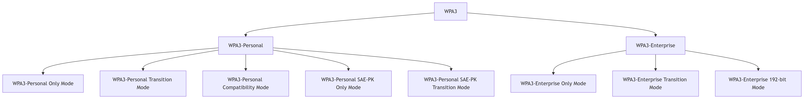
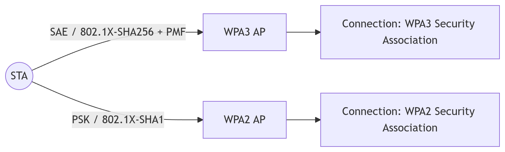
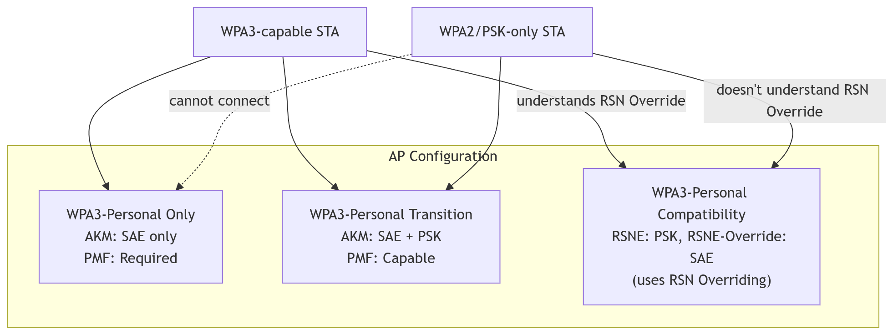
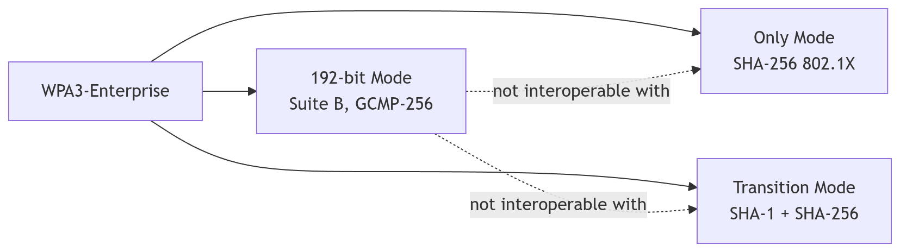
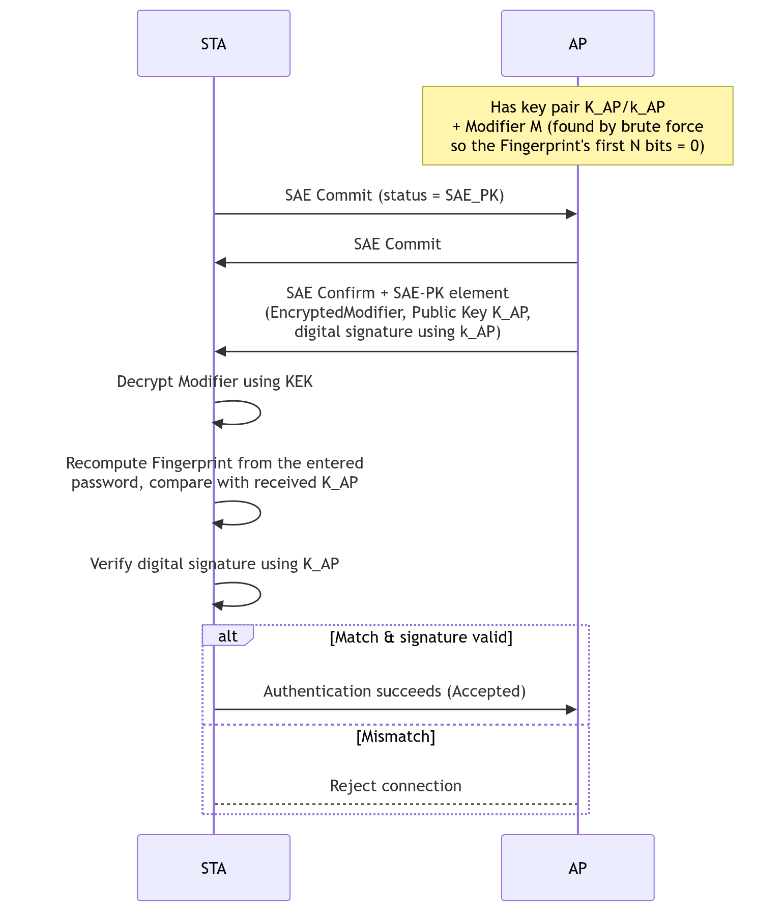
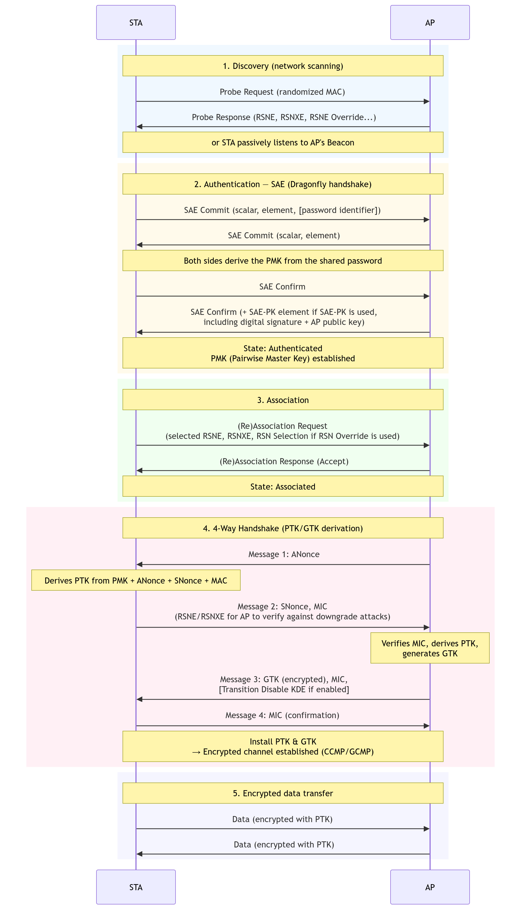
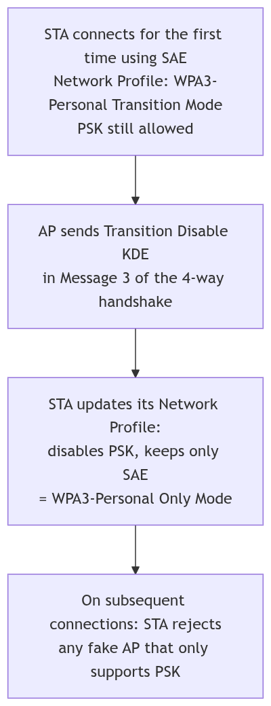
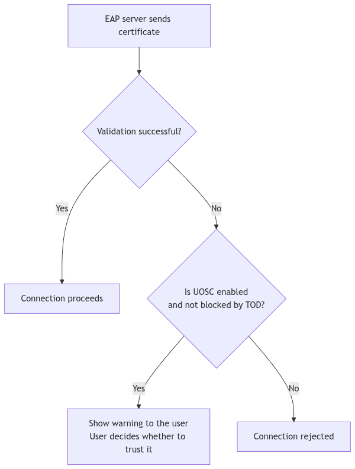
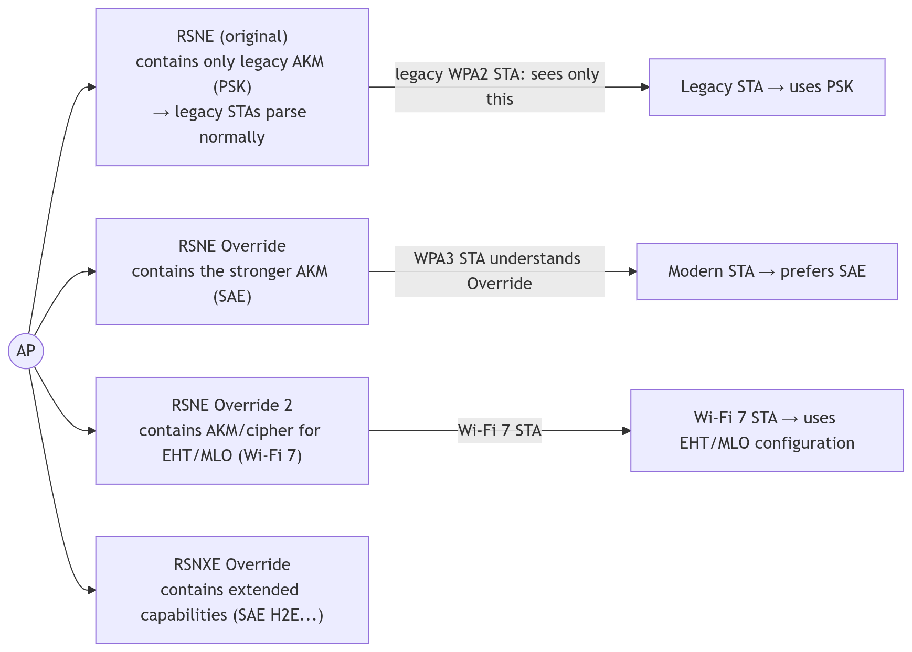
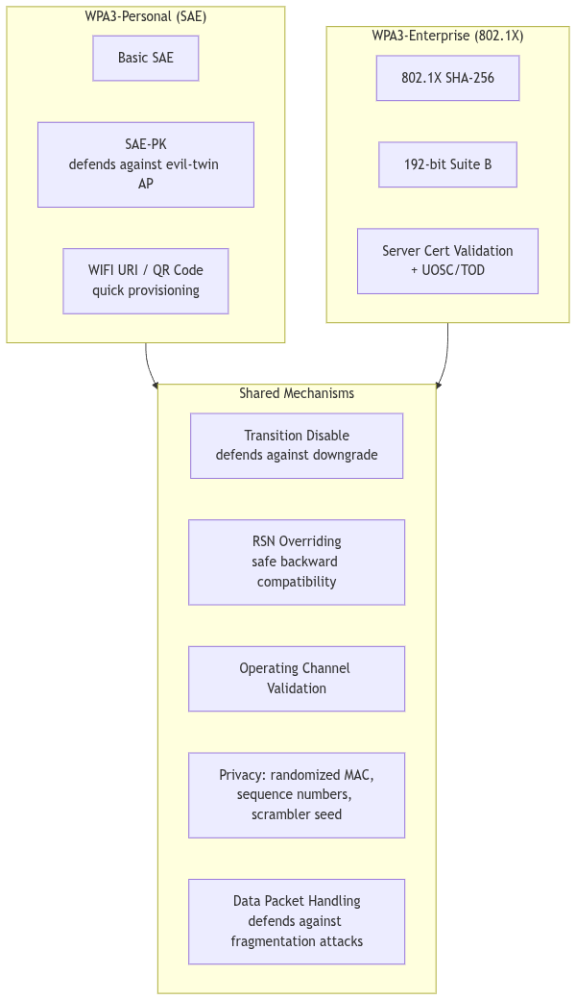

<div style="text-align: justify; text-indent: 2em;">
In June 2018, the Wi-Fi Alliance officially announced WPA3 (Wi-Fi Protected Access 3), the most significant overhaul of wireless security in over a decade. The announcement came not a moment too soon — by that point, WPA2, which had been the industry standard since 2004, was showing serious cracks.
</div>

<div style="text-align: justify; text-indent: 2em;">
The most devastating blow to WPA2's reputation came in October 2017 with the disclosure of KRACK (Key Reinstallation Attack), a vulnerability that allowed attackers to manipulate and potentially decrypt WPA2-protected traffic by exploiting weaknesses in the four-way handshake protocol. Around the same time, research demonstrated that offline dictionary attacks against WPA2-PSK (Pre-Shared Key) networks were remarkably practical, especially as GPU-accelerated cracking tools became widely available.
</div>

<div style="text-align: justify; text-indent: 2em;">
Note: By 2018, WPA2-PSK networks were vulnerable to offline brute-force attacks that could be executed on commodity hardware at billions of password guesses per second — a sobering reality for anyone relying on a short Wi-Fi passphrase.
</div>

<div style="text-align: justify; text-indent: 2em;">
WPA3 was designed from the ground up to address these vulnerabilities, modernize cryptographic standards, and make Wi-Fi security robust enough for the next generation of connected devices — from smartphones and laptops to IoT sensors and smart-city infrastructure.
</div>

---
 
### History of Wi-Fi Security

<div style="text-align: justify; text-indent: 2em;">
Understanding WPA3 requires appreciating the lineage it evolved from. Wi-Fi security did not begin strong — it began as almost an afterthought.
</div>

##### WEP (1997–2003)

<div style="text-align: justify; text-indent: 2em;">
Wired Equivalent Privacy (WEP) was introduced alongside the original 802.11 standard. It used the RC4 stream cipher with a 40-bit (later 104-bit) key and a 24-bit Initialization Vector (IV). By 2001, researchers had demonstrated that WEP could be cracked in minutes by passively collecting enough packets. The IV space was too small, key management was static, and the protocol lacked integrity protection. WEP was formally deprecated in 2004.
</div>

##### WPA (2003–2004)

<div style="text-align: justify; text-indent: 2em;">
Wi-Fi Protected Access (WPA) was a transitional standard designed to run on existing WEP hardware. It introduced TKIP (Temporal Key Integrity Protocol), which dynamically generated per-packet keys using a 128-bit key and a per-packet mixing function. While far better than WEP, TKIP was a patch over a fundamentally weak cipher (RC4) and was eventually found to be vulnerable to certain theoretical attacks.
</div>

##### WPA2 (2004–2018)

<div style="text-align: justify; text-indent: 2em;">
WPA2 introduced mandatory support for AES-CCMP (Advanced Encryption Standard in Counter Mode with CBC-MAC), a vastly stronger encryption scheme. WPA2 became the gold standard for over 14 years. However, its four-way handshake remained susceptible to offline dictionary attacks, and the KRACK vulnerability of 2017 exposed deeper flaws in its key reinstallation logic.
</div>

---
 
### What is the WPA3?

<div style="text-align: justify; text-indent: 2em;">
WPA3 (Wi-Fi Protected Access 3) is the security standard succeeding WPA2, split into two main branches:
</div>

<div style="text-align: justify; text-indent: 2em;">
- WPA3-Personal: for home/personal networks, authenticated with a password via SAE (Simultaneous Authentication of Equals), replacing WPA2's PSK.
</div>

<div style="text-align: justify; text-indent: 2em;">
- WPA3-Enterprise: for enterprise networks, authenticated via 802.1X/EAP (certificates, username/password, SIM, etc.), with an additional 192-bit mode for high-security environments (government, defense).
</div>

<div style="text-align: justify; text-indent: 2em;">
Each device (AP or STA) is configured to operate in one of several "modes" — combinations of allowed AKMs (Authentication and Key Management), cipher suites, and PMF (Protected Management Frames) requirements.
</div>



---

### Types of "Security Association" (WPA2 vs WPA3)

<div style="text-align: justify; text-indent: 2em;">
When an AP and STA successfully connect, the result can be a WPA3 security association or a WPA2 security association, depending on the negotiated AKM and PMF.
</div>

| Condition | Result |
|---|---|
| AKM ∈ {SAE, FT-SAE, 802.1X-SHA256, FT-802.1X, 802.1X 192-bit, FT-802.1X-SHA384} and PMF enabled | WPA3 |
| AKM ∈ {PSK, FT-PSK, 802.1X-SHA1, FT-802.1X} | WPA2 |
| WPA3 STA connects to a WPA2-only AP (or vice versa) | WPA2 (downgraded) |



### WPA3-Personal — Modes
##### WPA3-Personal Only Mode

<div style="text-align: justify; text-indent: 2em;">
- Only enables the SAE AKM (00-0F-AC:8) and/or SAE group-dependent hash (00-0F-AC:24).
</div>

<div style="text-align: justify; text-indent: 2em;">
- Prohibits any PSK-type AKM.
</div>

<div style="text-align: justify; text-indent: 2em;">
- PMF Required (MFPC=1, MFPR=1).
</div>

<div style="text-align: justify; text-indent: 2em;">
- ⇒ Legacy devices that only support PSK will not be able to connect.
</div>

##### WPA3-Personal Transition Mode
<div style="text-align: justify; text-indent: 2em;">
- Enables both SAE and PSK simultaneously for backward compatibility with WPA2 devices.
</div>

<div style="text-align: justify; text-indent: 2em;">
- PMF is Capable (MFPC=1, MFPR=0) — not mandatory, but if the STA selects SAE, PMF must still be negotiated.
</div>

<div style="text-align: justify; text-indent: 2em;">
- WPA3-capable STAs will automatically pick SAE (more secure); legacy STAs use PSK.
</div>

<div style="text-align: justify; text-indent: 2em;">
- Not used in the 6 GHz or Sub-1GHz bands (these bands require SAE only).
</div>

##### WPA3-Personal Compatibility Mode

<div style="text-align: justify; text-indent: 2em;">
- A newer mechanism (since v3.4) that uses RSN Overriding so the AP can advertise PSK (in the regular RSNE) and SAE (in the RSNE Override) at the same time — allowing modern WPA3 STAs to see SAE without breaking compatibility with legacy WPA2 STAs (some older STAs fail when the RSNE advertises multiple AKMs at once).
</div>

<div style="text-align: justify; text-indent: 2em;">
- There is no separate STA mode — a STA that understands RSN Override will upgrade to WPA3; a STA that doesn't will fall back to WPA2.
</div>

##### WPA3-Personal SAE-PK Only/Transition Mode

<div style="text-align: justify; text-indent: 2em;">
See details in section 6 (SAE-PK).
</div>



--- 

### WPA3-Enterprise — Modes

| Mode | Required/Allowed AKM | PMF | Notes |
|---|---|---|---|
| Only Mode | 802.1X-SHA256 (`00-0F-AC:5`) | Required | SHA1 prohibited |
| Transition Mode | SHA1 (`00-0F-AC:1`) + SHA256 (`00-0F-AC:5`) | Capable | Backward compatibility |
| 192-bit Mode | Suite-B 192-bit (`00-0F-AC:12`) | Required | GCMP-256 + BIP-GMAC-256; strong EAP certificates required |



---

### AKM Summary Table

| AKM Selector | Name | Type | Security Association |
|---|---|---|---|
| 00-0F-AC:2 | PSK | Personal | WPA2 |
| 00-0F-AC:4 | FT over PSK | Personal | WPA2 |
| 00-0F-AC:6 | PSK SHA-256 | Personal | WPA2 |
| 00-0F-AC:8 | SAE | Personal | WPA3 |
| 00-0F-AC:9 | FT over SAE | Personal | WPA3 |
| 00-0F-AC:24 | SAE (group-dependent hash) | Personal | WPA3 |
| 00-0F-AC:25 | FT over SAE (group-dependent hash) | Personal | WPA3 |
| 00-0F-AC:1 | 802.1X SHA-1 | Enterprise | WPA2 |
| 00-0F-AC:5 | 802.1X SHA-256 | Enterprise | WPA3 |
| 00-0F-AC:3 | FT over 802.1X | Enterprise | WPA3 (if PMF enabled) |
| 00-0F-AC:12 | 802.1X SHA-384 (Suite B 192-bit) | Enterprise | WPA3 192-bit |

##### STA AKM Selection Preference Order

<div style="text-align: justify; text-indent: 2em;">
When an AP advertises multiple AKMs, a WPA3 STA must select according to this descending preference order:
</div>

<div style="text-align: justify; text-indent: 2em;">
Personal: FT-SAE(H2E) → SAE(H2E) → FT-SAE → SAE → FT-PSK → PSK-SHA256 → PSK
</div>

<div style="text-align: justify; text-indent: 2em;">
Enterprise: FT-802.1X-SHA256 → 802.1X-SHA256 → 802.1X-SHA1
</div>

---

### SAE-PK (SAE Public Key)

#####  The Problem

<div style="text-align: justify; text-indent: 2em;">
With regular SAE/PSK, the password is a symmetric secret — anyone who knows the password (including an attacker) can impersonate the AP ("evil twin") to launch a man-in-the-middle attack.
</div>

##### The SAE-PK Solution

<div style="text-align: justify; text-indent: 2em;">
The AP additionally holds an ECDSA public/private key pair. The SAE-PK password is generated so that it represents a fingerprint of the AP's public key → it serves both as the access password and as a way for the STA to authenticate the AP's identity.
</div>



##### SAE-PK Password Format

<div style="text-align: justify; text-indent: 2em;">
Example (λ=12): `a2bc-de3f-ghi4`
</div>
<div style="text-align: justify; text-indent: 2em;">
- Base32-encoded (lowercase), with a hyphen inserted every 4 characters.
</div>
<div style="text-align: justify; text-indent: 2em;">
- A final checksum character (Verhoeff algorithm) to detect typos.
</div>
<div style="text-align: justify; text-indent: 2em;">
- The `Sec` parameter (3 or 5 octets) determines the strength against *second-preimage* attacks.
</div>

| λ (character count) | Sec | Strength S (bits) | Average brute-force time (50 TH/s) |
|---|---|---|---|
| 12 | 3 | 76 | 48 years |
| 12 | 5 | 92 | 3.1 million years |
| 16 | 3 | 95 | 25.1 million years |
| 16 | 5 | 111 | 1.6 trillion years |

---
 
### WIFI URI / QR Code

<div style="text-align: justify; text-indent: 2em;">
WPA3 defines a `WIFI:...;;` syntax for embedding network information into a QR code, enabling quick device provisioning.
</div>

```
WIFI:T:WPA;R:3;S:MyNet;P:a2bc-de3f-ghi4;K:<base64 public key>;;
```

| Field | Meaning |
|---|---|
| `T` | Security type (WPA = password-based; absent = open network/Enhanced Open) |
| `R` | Transition Disable bitmap (hex form) |
| `S` | SSID |
| `H` | Hidden SSID (true/false) |
| `I` | SAE Password Identifier |
| `P` | Password |
| `K` | AP public key (only present when SAE-PK is supported) |
 
---

### WPA3-Personal (SAE) Connection Message Flow



---

### Transition Disable

<div style="text-align: justify; text-indent: 2em;">
The Problem: A STA configured in "Transition Mode" (accepting both WPA2 & WPA3) can still be tricked into connecting to a fake AP that only supports weaker algorithms (PSK, SHA-1, etc.).
</div>

<div style="text-align: justify; text-indent: 2em;">
The Solution: After successfully connecting using the strongest algorithm, the AP sends the STA a Transition Disable KDE (in the 4-way handshake, encrypted) — instructing the STA to lock down its Network Profile so it no longer allows weaker algorithms on subsequent connections.
</div>

<div style="text-align: center;">



</div>

#### Transition Disable Bitmap Bits

| Bit | Name | Strongest algorithm | Algorithms disabled |
|---|---|---|---|
| 0 | WPA3-Personal Only | SAE / SAE(H2E) | All PSK / FT-PSK |
| 1 | SAE-PK Only | SAE-PK | SAE without SAE-PK, PSK |
| 2 | WPA3-Enterprise | 802.1X SHA-256 | 802.1X SHA-1 |
| 3 | Wi-Fi Enhanced Open | OWE | Open without encryption |
 
---

### Server Certificate Validation & UOSC (WPA3-Enterprise)

<div style="text-align: justify; text-indent: 2em;">
When using EAP-TLS/TTLS/PEAP, the STA is required to validate the server's certificate. If validation fails, the STA may (optionally) allow the user to perform UOSC – User Override of Server Certificate (manual acceptance) — unless prohibited by a TOD (Trust Override Disable) policy embedded in the certificate:
</div>

<div style="text-align: justify; text-indent: 2em;">
- TOD-STRICT: Prohibits UOSC entirely (even on the very first connection).
</div>
<div style="text-align: justify; text-indent: 2em;">
- TOD-TOFU: Allows UOSC on the first connection (Trust-On-First-Use), but prohibits it on subsequent connections once a certificate has been stored.
</div>

<div style="text-align: center;">



</div>

--- 

### RSN Overriding — Solving Compatibility Issues When Extending the Standard

<div style="text-align: justify; text-indent: 2em;">
The Problem: Some legacy STAs fail/crash when parsing an RSNE that lists too many AKMs/ciphers at once (e.g., when an AP adds SAE alongside PSK).
</div>

<div style="text-align: justify; text-indent: 2em;">
The Solution: Instead of stuffing everything into one RSNE, the AP splits the information into multiple separate elements:
</div>



<div style="text-align: justify; text-indent: 2em;">
- A STA that supports RSN Overriding signals this capability by setting the last six octets of its SNonce to a fixed value `50:6F:9A:00:00:29` (SNonce cookie) during the 4-way handshake — the AP recognizes this and returns all RSNE/RSNXE variants in Message 3 so the STA can verify it isn't being subjected to a downgrade attack (ensuring the AP isn't hiding stronger security options).
</div>

<div style="text-align: justify; text-indent: 2em;">
- This mechanism is the foundation of WPA3-Personal Compatibility Mode (section 3.3).
</div>

--- 

### Constraints by Frequency Band / Wi-Fi Generation

| Band / Standard | Key constraints |
|---|---|
| 6 GHz | PMF Required is mandatory; TKIP, PSK, 802.1X-SHA1 prohibited; WPA3-Personal/Enterprise Transition Mode prohibited; SAE Hunting-and-Pecking prohibited (Hash-to-Element only) |
| Sub-1GHz | Similar to 6 GHz (Transition Mode prohibited, PMF mandatory) |
| EHT / MLO (Wi-Fi 7) | PSK and 802.1X-SHA1 prohibited in associations using EHT/MLO; AKM 00-0F-AC:24 (SAE-H2E) & GCMP-256 mandatory; unencrypted Open prohibited |

---

### Data Packet Handling Protections

<div style="text-align: justify; text-indent: 2em;">
The specification lists numerous real-world vulnerabilities that have been exploited (fragmentation/cache attacks, plaintext injection, etc.) and requires devices to:
</div>

<div style="text-align: justify; text-indent: 2em;">
1. Never reassemble fragments encrypted with different keys.
</div>
<div style="text-align: justify; text-indent: 2em;">
2. Discard incomplete fragments upon a new association/reassociation (to prevent cache attacks).
</div>
<div style="text-align: justify; text-indent: 2em;">
3. Verify that the Packet Number (PN) of consecutive fragments increments by exactly 1.
</div>
<div style="text-align: justify; text-indent: 2em;">
4. Reject plaintext fragments when the MSDU/MMPDU is expected to be encrypted.
</div>
<div style="text-align: justify; text-indent: 2em;">
5. Never accept fragmented broadcast/multicast frames.
</div>
<div style="text-align: justify; text-indent: 2em;">
6. Check each A-MSDU subframe individually, preventing abuse of a fake EAPOL header.
</div>
<div style="text-align: justify; text-indent: 2em;">
7. APs must not forward EAPOL frames (to prevent DoS).
</div>
<div style="text-align: justify; text-indent: 2em;">
8. Verify TKIP MIC at the full MSDU level.
</div>

---

### Combined Overview of the WPA3 Ecosystem

<div style="text-align: center;">



</div>

---

### Source
Original document: *WPA3™ Specification Version 3.5*, Wi-Fi Alliance, © 2025 (copyright owned by Wi-Fi Alliance, used under the terms stated in the original document).